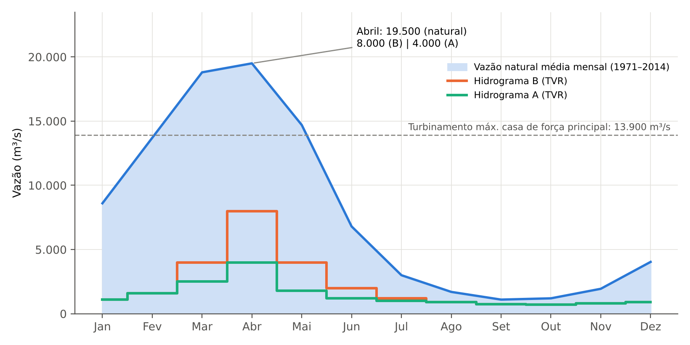
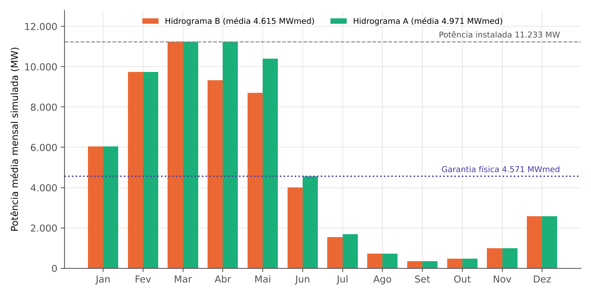

# Resumo

As restrições hidráulicas operativas — limites de vazão defluente mínima e máxima, de níveis de reservatório, de taxas de variação e de turbinamento — convertem usos múltiplos da água, segurança de barragens e condicionantes ambientais em regras que o Operador Nacional do Sistema Elétrico (ONS) precisa respeitar ao despachar as usinas hidrelétricas. Este artigo examina essas restrições em escala nacional, bacia a bacia (São Francisco, Paraná, Grande, Paranaíba, Paranapanema, Iguaçu, Uruguai, Tocantins, Paraíba do Sul e bacias amazônicas), identifica seus valores, o instrumento que as sustenta (outorga da Agência Nacional de Águas e Saneamento Básico – ANA, licença do IBAMA, cadastro do ONS, decisões do Comitê de Monitoramento do Setor Elétrico – CMSE) e suas implicações energéticas, ambientais e regulatórias. Em seguida, aprofunda o caso da UHE Belo Monte, cujo regime de vazões no Trecho de Vazão Reduzida (TVR) da Volta Grande do Xingu é definido pelos hidrogramas A e B incorporados à outorga da ANA. Descreve-se o funcionamento desses hidrogramas e, com um balanço hídrico mensal calibrado nos dados públicos (que reproduz a garantia física oficial com diferença de 1,0%), quantificam-se alavancas de flexibilização. Os resultados indicam que o armazenamento físico em Belo Monte é irrelevante para a regularização sazonal (1 m de deplecionamento equivale a cerca de 0,16 GWmês, frente a um déficit de aproximadamente 15,7 GWmês no período seco), de modo que "água armazenada para o período seco" só pode ser obtida no sistema, por meio de maior aproveitamento da vazão no período úmido e de coordenação com os reservatórios de regularização, ou em escala horária, por modulação para atendimento da ponta. Propõem-se seis medidas de flexibilização condicionadas a salvaguardas ecológicas e a governança compartilhada entre ANA, IBAMA, ONS, ANEEL e Ministério de Minas e Energia.

**Palavras-chave:** restrições operativas hidráulicas; Sistema Interligado Nacional; outorga; hidrograma; Belo Monte; regularização.

# Abstract

Hydraulic operating constraints — minimum and maximum outflows, reservoir levels, ramping rates and minimum turbine discharges — translate multiple water uses, dam safety and environmental conditions into rules that Brazil's system operator (ONS) must observe when dispatching hydropower plants. This article reviews these constraints nationwide, basin by basin, identifies their values, the legal instruments that support them (water-use permits issued by the National Water Agency – ANA, IBAMA licences, ONS registries and CMSE decisions) and their energy, environmental and regulatory implications. It then examines the Belo Monte Hydropower Plant, whose flow regime in the Xingu's Volta Grande Reduced-Flow Reach is set by hydrographs A and B embedded in ANA's permit. Using a monthly water balance calibrated on public data (reproducing the official firm energy within 1.0%), the study quantifies flexibilization levers. Physical storage at Belo Monte is negligible for seasonal regulation: a 1 m drawdown is worth about 0.16 GW-month against a dry-season shortfall of about 15.7 GW-month. "Stored water for the dry season" can therefore only be obtained at system level — by using more of the wet-season flow and coordinating with regulating reservoirs — or at hourly scale, through peak-shaping. Six flexibilization measures are proposed, subject to ecological safeguards and shared governance among ANA, IBAMA, ONS, ANEEL and the Ministry of Mines and Energy.

**Keywords:** hydraulic operating constraints; Brazilian interconnected system; water-use permit; hydrograph; Belo Monte; regulation.

# 1 Panorama: a capacidade hidrelétrica em 2015 e hoje

Para situar o problema, convém começar pela evolução recente do parque hidrelétrico brasileiro. No fim de 2015, a capacidade instalada de geração do país era de 140,9 GW, dos quais 91,7 GW (65,1%) em usinas hidráulicas (BRASIL, 2016). Um ano depois, o parque hidrelétrico somava 96.925 MW, um acréscimo de 5.278 MW em relação ao ano anterior, dos quais 91.499 MW em grandes usinas, 4.941 MW em pequenas centrais e 490 MW em centrais geradoras (BERTOL, 2017). Segundo as sínteses do Balanço Energético Nacional, a capacidade hidráulica atingiu 104.139 MW em 2018, 109.058 MW em 2019, 109.350 MW em 2021 e 109.922 MW em 2023 e 2024, o que representa estabilização a partir de 2019 (EPE, 2020; 2022; 2024; 2025). Em janeiro de 2026, o Sistema de Informações de Geração da ANEEL registrava 215.936,9 MW de potência fiscalizada, com 47,67% em usinas hidrelétricas de grande porte, 2,92% em pequenas centrais e 0,92% em centrais geradoras (PODER360, 2026) — o que, por cálculo dos autores sobre esses percentuais, corresponde a cerca de 111 GW hidráulicos, ou 51,5% do total.

A Figura 1 sintetiza esse movimento: entre 2015 e 2024 a capacidade hidrelétrica cresceu cerca de 18,3 GW (20%), mas a participação da fonte hídrica na capacidade total caiu de 65,1% para aproximadamente 51,5%, porque o parque total cresceu cerca de 53%, impulsionado por fontes eólica, solar e térmica. Uma única usina responde pela maior parte do acréscimo hidráulico: Belo Monte, com 11.233 MW, equivale a aproximadamente 61% do aumento líquido de capacidade hidráulica observado no período (cálculo dos autores a partir de Norte Energia, 2020, e EPE, 2025). A expansão hídrica de 2025 foi residual: 11 pequenas centrais (199,34 MW), uma usina (50 MW) e três centrais geradoras (6,70 MW), cerca de 3,5% dos 7.403,54 MW adicionados ao sistema no ano (PODER360, 2026).

{width=16.5cm}

*Fonte: elaboração própria a partir de Brasil (2016), Bertol (2017), EPE (2020; 2022; 2024; 2025) e Poder360 (2026). O valor de jan./2026 em (b) é calculado a partir dos percentuais do SIGA/ANEEL; os valores de 2015 e de 2018–2024 provêm de séries distintas (MME e EPE) e podem diferir levemente de extratos do Banco de Informações de Geração da ANEEL (por exemplo, 90.619 MW em nov./2015).*

O ponto decisivo para o tema deste artigo é que a capacidade cresceu, mas a capacidade de armazenamento não. A energia armazenável máxima (EARmáx) dos subsistemas Sudeste/Centro-Oeste, Sul e Nordeste somava 276.735 MWmês em 2015 (205.002, 19.873 e 51.860 MWmês, respectivamente; O SETOR ELÉTRICO, 2015) e 274.666 MWmês em 2021 (203.567, 19.897 e 51.602 MWmês); com o subsistema Norte (15.165 MWmês), o total do SIN era de 290.231 MWmês em 2021 (SÃO PAULO, 2021, com dados do ONS) e de 292.333 MWmês no Plano da Operação Energética 2022 (ONS, 2022a). Em termos relativos, o grau de regularização do SIN — a razão entre a EARmáx e a carga descontada da geração inflexível, em meses — foi de 6,5 meses em 2002, de 5,8 meses em 2021 e é projetado em 5,3 meses para 2025 (ONS, 2021a). Falcetta (2015) já havia documentado, para a série histórica desde 1950 e para o horizonte de planejamento até 2023, queda contínua e significativa da capacidade relativa de regularização do sistema hidrelétrico brasileiro, e matéria especializada registra que, entre 1998 e 2024, apenas dois reservatórios de acumulação foram adicionados ao SIN, contra 48 usinas a fio d'água (O SETOR ELÉTRICO, [2024?]).

{width=16.5cm}

*Fonte: elaboração própria a partir de EPE (2020; 2022), ONS (2021a; 2022a) e dados de EARmáx de 2015 e 2021 citados no texto. O índice em (a) usa o conjunto SE/CO + S + NE porque o valor de 2015 do subsistema Norte não foi localizado.*

O resultado é um sistema com mais potência hidráulica e proporcionalmente menos estoque d'água: o índice de capacidade hidrelétrica de 2021 é 119 (2015 = 100), enquanto o da EARmáx é 99,4. Nesse sistema, cada restrição hidráulica pesa mais, porque há menos reservatório para absorver variações de afluência, e porque as novas usinas — sobretudo as amazônicas — não podem "guardar" a água que não é turbinada. É nesse contexto que as restrições hidráulicas se tornaram uma das variáveis mais disputadas da operação do setor elétrico, e que o caso de Belo Monte, a maior usina a fio d'água do país, se torna emblemático.

# 2 Introdução, objetivos e nota metodológica

## 2.1 Problema e objetivos

A operação das usinas hidrelétricas brasileiras é regida por um duplo ordenamento. De um lado, a lógica eletroenergética do Sistema Interligado Nacional (SIN), na qual o ONS busca, com modelos de otimização hidrotérmica, minimizar o custo esperado de atendimento à carga ao longo de horizontes de meses a anos (PEREIRA; PINTO, 1991). De outro, a lógica dos usos múltiplos da água, consagrada na Política Nacional de Recursos Hídricos (BRASIL, 1997), que exige que a vazão e o nível dos reservatórios atendam também ao abastecimento, à navegação, ao controle de cheias, à pesca, ao turismo e à preservação de ecossistemas. A interface entre esses dois ordenamentos são as chamadas restrições operativas hidráulicas (ROH): limites declarados pelos agentes de geração ao ONS, com base em outorgas, licenças ambientais, contratos e diretrizes de segurança, que o operador deve observar no planejamento e na operação em tempo real (ONS, 2024).

Este artigo tem quatro objetivos: (i) mapear as restrições hidráulicas das principais bacias do SIN, com seus valores e instrumentos de origem; (ii) descrever o arcabouço institucional que as cria, altera e fiscaliza, com ênfase nas relações entre ANA, IBAMA, ONS, ANEEL, Ministério de Minas e Energia (MME) e Tribunal de Contas da União (TCU); (iii) detalhar o funcionamento dos hidrogramas da ANA para a UHE Belo Monte; e (iv) avaliar como esses hidrogramas poderiam ser flexibilizados para ampliar a água disponível ao sistema no período seco, discutindo os limites físicos e os custos ecológicos de cada alternativa.

## 2.2 Procedimentos e limitações

O estudo é uma análise documental e quantitativa de natureza exploratória. As fontes primárias consideradas são resoluções e outorgas da ANA, licenças e pareceres técnicos do IBAMA, cadastros e referências técnicas do ONS, relatórios da EPE, decisões do TCU e do Judiciário, além de literatura científica. A coleta dos documentos foi feita por consulta a trechos e resumos indexados, uma vez que o acesso direto a alguns repositórios oficiais não esteve disponível durante a elaboração; por isso, (a) sempre que possível os valores foram conferidos em pelo menos duas fontes independentes, (b) valores sustentados por fonte única, antigos ou com divergência entre fontes são sinalizados no texto e (c) recomenda-se que qualquer uso técnico ou jurídico dos valores aqui reproduzidos seja precedido de conferência com o texto consolidado vigente do ato normativo correspondente. As restrições mudam com frequência — em 2026 houve, por exemplo, nova revisão do cadastro do ONS para a bacia do Uruguai e nova autorização da ANA para Belo Monte — e a data de cada valor é indicada sempre que conhecida.

A análise quantitativa do caso de Belo Monte (Seção 8.5) utiliza um balanço hídrico mensal simplificado, descrito e parametrizado na própria seção, com código aberto no repositório que acompanha este artigo. Os resultados devem ser lidos como ordens de grandeza e comparações relativas entre cenários; não substituem os modelos de planejamento (NEWAVE, DECOMP e DESSEM), a modelagem hidrodinâmica empregada pelo IBAMA nem os estudos ecológicos de campo.

# 3 Revisão bibliográfica

A literatura pertinente ao tema atravessa quatro campos que raramente dialogam entre si: a engenharia de operação de reservatórios e o planejamento hidrotérmico; a hidrologia e a ecologia de rios regulados (vazões ambientais); a economia e a regulação do setor elétrico brasileiro; e os estudos socioambientais sobre as hidrelétricas amazônicas. Esta seção organiza as principais contribuições em cinco eixos e identifica a lacuna que o presente trabalho procura preencher.

## 3.1 Operação de reservatórios e planejamento hidrotérmico

A revisão clássica de Yeh (1985) sistematizou os modelos de gerenciamento e operação de reservatórios — programação linear, programação dinâmica, simulação e regras operativas derivadas — e mostrou que a escolha entre eles depende da dimensão do sistema e da natureza estocástica das afluências. Duas décadas depois, Labadie (2004) atualizou o estado da arte para sistemas de múltiplos reservatórios, destacando a programação dinâmica estocástica dual e as técnicas de decomposição como as únicas capazes de tratar cascatas de grande porte, e apontando a crescente necessidade de incorporar restrições ambientais e de usos múltiplos aos modelos. Loucks e van Beek (2017) consolidam esse corpo de conhecimento em um tratado de planejamento e gestão de sistemas de recursos hídricos, no qual as restrições de vazão mínima e máxima são tratadas como restrições de contorno cujo custo-sombra — o ganho marginal de relaxá-las — é uma informação central para a negociação entre usos.

No caso brasileiro, o marco metodológico é a programação dinâmica dual estocástica proposta por Pereira e Pinto (1991), que deu origem à família de modelos NEWAVE (planejamento de médio prazo), DECOMP (curto prazo) e DESSEM (programação diária), utilizados pelo ONS e pela Câmara de Comercialização de Energia Elétrica na formação do preço de curto prazo. Nesses modelos, a água armazenada tem um "valor" — o custo evitado de geração térmica futura — e as restrições hidráulicas entram como limites rígidos que reduzem o espaço de decisão e elevam o custo esperado. Kelman (2021) argumenta que as restrições operativas que não puderem ser suprimidas ou abrandadas devem ser incorporadas de modo definitivo aos modelos matemáticos do setor e que ANA e ONS deveriam avaliar, caso a caso, a relação custo-benefício de cada uma. A Nota Técnica da EPE sobre a escassez hídrica de 2021 caminha no mesmo sentido ao comparar, usina a usina, as restrições de vazão mínima vigentes e os valores alterados durante a crise (EPE, 2023).

Um terceiro grupo de trabalhos trata da evolução estrutural do sistema. Falcetta (2015) mostrou, com simulações no modelo HIDROTERM, que a queda da capacidade relativa de regularização afeta diretamente as decisões de operação e de expansão do parque térmico complementar. Análises do ONS, em seus Planos da Operação Energética, atribuem a perda de grau de regularização à entrada de usinas sem capacidade de acumulação anual e alertam que o sistema ficará cada vez mais dependente do período chuvoso para recompor os reservatórios (ONS, 2021a; 2022a). O resultado prático é a elevação do valor das restrições: se não há estoque suficiente, a flexibilidade de uma vazão mínima de 100 m³/s a mais ou a menos pode ser a diferença entre atender ou não a ponta.

## 3.2 Restrições operativas hidráulicas: conceitos e instrumentos

Nos Procedimentos de Rede, as restrições operativas hidráulicas são definidas como o conjunto de limitações da operação hidráulica dos aproveitamentos hidrelétricos que devem ser respeitadas, e são informadas ao ONS pelos próprios agentes de geração (ONS, 2024). A Referência Técnica RT-OR.BR.01 e o Submódulo 5.12 do Manual de Procedimentos da Operação descrevem como essas restrições são consideradas no planejamento anual, na programação e na operação em tempo real, prevendo que, em crises hidrológicas ou contingências, elas possam ser excluídas, modificadas ou criadas, e que ações de segurança de vidas e de instalações têm precedência sobre qualquer restrição (ONS, [s.d.]a). A base legal para a definição das condições de operação de reservatórios por agentes públicos e privados é a Lei nº 9.984/2000, que atribui à ANA a competência de definir e fiscalizar essas condições e determina que, para reservatórios de aproveitamentos hidrelétricos, a definição se dê em articulação com o ONS (BRASIL, 2000).

Os debates recentes da literatura técnica brasileira enfatizam que a tipologia das ROH é heterogênea e que nem toda restrição tem a mesma robustez jurídica. Kelman (2021) observa que há restrições "exageradas" ou que admitem solução simples, e usa como exemplo a redução da vazão mínima defluente de Porto Primavera, de 4.600 para 3.900 m³/s, decidida pelo CMSE, que caracteriza como um seguro energético e de potência. O mesmo autor lembra que a expansão de fontes eólica e solar poupa água dos reservatórios, mas reduz a capacidade do sistema de responder a variações instantâneas de carga — o que desloca o valor das restrições de energia (MWmed) para potência (MW).

## 3.3 Regime de vazões, vazões ambientais e reoperação

O corpo teórico das vazões ambientais parte do conceito de regime natural de vazões, segundo o qual a magnitude, a frequência, a duração, a época e a taxa de variação das vazões estruturam a integridade ecológica dos rios (POFF et al., 1997). Richter et al. (1996) propuseram os Indicadores de Alteração Hidrológica, que permitem quantificar o desvio entre regime natural e regime regulado, e Bunn e Arthington (2002) sintetizaram quatro princípios — o regime de vazões é o principal determinante do hábitat físico dos rios; as espécies aquáticas desenvolveram estratégias de história de vida em resposta direta ao regime natural; a manutenção da conectividade longitudinal e lateral é essencial; e a regulação das vazões favorece a invasão de espécies exóticas. Para rios de planície tropical, o conceito de pulso de inundação (JUNK; BAYLEY; SPARKS, 1989) é central: o ciclo anual de enchente e vazante conecta o canal às florestas alagáveis e aos lagos marginais e é o motor da produtividade pesqueira.

Tharme (2003) mapeou mais de 200 metodologias de avaliação de vazão ambiental em 44 países, classificando-as em hidrológicas, hidráulicas, de classificação de habitat e holísticas, enquanto Acreman e Dunbar (2004) discutiram a necessidade de combinar métodos e dados locais. Arthington et al. (2006) defenderam que regras de vazão ambiental sejam construídas a partir de relações entre alteração hidrológica e resposta ecológica, e Poff et al. (2010) formalizaram esse raciocínio no arcabouço ELOHA (limites ecológicos da alteração hidrológica). Na ausência de estudos locais, Richter et al. (2012) propõem um "padrão presuntivo" que limita a alteração da vazão a uma fração modesta (da ordem de 10% a 20%) da vazão natural em escala diária, como regra de proteção ecológica precaucionária. Esses referenciais são úteis para dimensionar o que significa, em termos ecológicos, um trecho que recebe menos de um terço da vazão natural anual, como a Volta Grande do Xingu.

A literatura também discute a possibilidade de reoperar barragens para recuperar funções ecológicas sem perda proporcional de benefícios. Richter e Thomas (2007) mostram, a partir de experiências em vários países, que modificações de regras operativas — liberação de pulsos, ajustes de sazonalidade, restrições de taxa de variação — podem restabelecer componentes do regime natural a custos relativamente baixos. Poff e Olden (2017) defendem que barragens sejam projetadas e operadas para a sustentabilidade, com adaptação periódica das regras. O corolário para o presente estudo é simétrico: se é possível reoperar para melhorar a ecologia, também é possível reoperar para melhorar a energia, desde que o ônus da prova ecológica seja explicitado e monitorado.

## 3.4 Hidrelétricas amazônicas, fio d'água e perda de regularização

A expansão hidrelétrica amazônica motivou uma literatura crítica extensa. Fearnside (2006) já advertia, para o complexo Belo Monte, que a viabilidade energética do projeto dependia da regularização a montante — o reservatório Babaquara/Altamira, de cerca de 6.140 km², que elevaria a geração ao uniformizar a vazão do Xingu — e que o desenho de uma usina de reservatório pequeno e grande potência instalada deixava a geração à mercê da forte sazonalidade do rio; Sousa Júnior, Reid e Leitão (2006) e Sousa Júnior e Reid (2010) examinaram, em análises de custo-benefício e de cenários de risco, a sensibilidade da viabilidade econômica do projeto a premissas como o custo total e a potência efetivamente gerada. O Painel de Especialistas (MAGALHÃES; HERNANDEZ, 2009) produziu uma análise crítica multidisciplinar do Estudo de Impacto Ambiental, entregue ao IBAMA e ao Ministério Público Federal em outubro de 2009, que questionou, entre outros pontos, a subestimação da população atingida e das consequências sobre a biodiversidade.

Do ponto de vista regional, Winemiller et al. (2016) alertaram para o equilíbrio entre geração hidrelétrica e biodiversidade nas bacias do Amazonas, do Congo e do Mekong, Latrubesse et al. (2017) quantificaram a fragmentação das bacias amazônicas pelo conjunto de barragens existentes e planejadas, Lees et al. (2016) discutiram os impactos sobre a biodiversidade e Athayde et al. (2019) mapearam as lacunas do conhecimento sobre hidrelétricas e sustentabilidade na Amazônia brasileira. Flecker et al. (2022) propuseram uma estratégia de planejamento integrado em escala de bacia para reduzir os impactos adversos da expansão hidrelétrica amazônica. Stickler et al. (2013) mostraram que a geração hidrelétrica amazônica depende da cobertura florestal em escalas local e regional, o que torna as projeções de afluência — e, portanto, de energia — sensíveis ao desmatamento e ao clima.

## 3.5 Belo Monte, hidrograma e Volta Grande

A literatura específica sobre Belo Monte divide-se entre estudos de processo decisório e análises hidrológico-ecológicas. Fearnside (2017) reconstitui os atores e argumentos da disputa e conclui que argumentos lógicos, legais e éticos tiveram menos peso do que as forças políticas e empresariais que priorizaram a obra. Sabaj Pérez (2015) e Fitzgerald et al. (2018) documentam a singularidade da Volta Grande do Xingu como hotspot de diversidade de peixes de corredeiras, o que dá a medida do que está em jogo na definição das vazões do TVR. Estudos de monitoramento recentes apontam efeitos: Keppeler et al. (2022) analisaram dados de monitoramento de longo prazo e identificaram impactos precoces da operação sobre comunidades de peixes, e Pezzuti et al. (2024), em artigo de política pública assinado por pesquisadores de dez instituições, afirmam que, desde 2019, a Volta Grande de cerca de 130 km recebe menos de 30% de sua vazão natural anual e perdeu mais de 80% de sua vazão natural, defendendo mudanças de governança antes da renovação da licença de operação.

Do lado do setor elétrico, a literatura é predominantemente institucional — pareceres, notas técnicas e relatórios — e se concentra na quantificação do efeito dos hidrogramas sobre a garantia física e sobre o custo da energia. A auditoria do TCU (2025) estima que a manutenção do hidrograma mais conservador pode elevar em até 1,7% o custo da energia no mercado regulado, por conta de uma redução média de 39,2% da garantia física da usina entre fevereiro e junho e da necessidade de contratar energia de reserva. Projeções climáticas indicam que o problema tende a se agravar: estudos citados por Escobar ([2025?]) projetam, com base em modelos do IPCC, redução da vazão do Xingu da ordem de 20% a 30% por volta de 2050–2060, o que reduziria o espaço de conciliação entre energia e ecologia.

## 3.6 Lacuna

Os textos revisados oferecem teoria sobre operação ótima, evidência ecológica sobre alteração de vazões e crítica social e econômica da expansão amazônica, mas há duas lacunas relevantes. Primeiro, não há, na literatura consultada, uma visão comparada das restrições hidráulicas entre as bacias do SIN que permita identificar padrões regulatórios — como a adoção recente de faixas de operação condicionadas ao armazenamento — e transpô-los para casos como o de Belo Monte. Segundo, a discussão sobre o hidrograma de Belo Monte tende a se polarizar entre quem defende a revisão para ampliar a proteção ecológica e quem defende a flexibilização por segurança energética, sem quantificar o que cada alavanca de fato entrega em energia e em armazenamento. O presente artigo procura contribuir para ambas.

# 4 Arcabouço institucional: quem cria, altera e fiscaliza as restrições

As restrições hidráulicas não têm uma fonte única. Elas resultam da sobreposição de instrumentos emitidos por instituições com mandatos distintos, e boa parte dos conflitos recentes decorre dessa sobreposição. O Quadro 1 sintetiza os principais atores e instrumentos; os parágrafos seguintes detalham as relações entre eles.

**Quadro 1 – Atores, instrumentos e papel na formação das restrições hidráulicas**

| Instituição | Instrumento principal | Papel nas restrições hidráulicas |
|:--|:--|:--|
| ANA | Declaração de Reserva de Disponibilidade Hídrica (DRDH), outorga de direito de uso, resoluções de condições de operação de reservatórios, salas de situação | Define e fiscaliza condições de operação de reservatórios para garantir usos múltiplos; em hidrelétricas, em articulação com o ONS (Lei nº 9.984/2000) |
| IBAMA | Licenças Prévia, de Instalação e de Operação; pareceres técnicos; ofícios | Estabelece condicionantes ambientais (vazão remanescente, monitoramento, gatilhos de paralisação); avalia adequação ambiental de hidrogramas |
| ONS | Cadastros de Informações Operacionais Hidráulicas; Referência Técnica RT-OR.BR.01; Instruções de Operação; Programa Mensal da Operação | Recebe as restrições declaradas pelos agentes, as incorpora aos modelos e à operação em tempo real; propõe flexibilizações |
| ANEEL | Contrato de concessão; garantia física (em conjunto com MME/EPE); regulação do MRE | Fiscaliza a concessão; define efeitos comerciais das restrições sobre a garantia física e o risco hidrológico |
| MME, CMSE e CREG | Portarias; decisões do CMSE; resoluções da Câmara de Regras Excepcionais para Gestão Hidroenergética (MP nº 1.055/2021) | Decidem sobre flexibilizações em situações de escassez; conduzem articulação política |
| EPE | Estudos de garantia física e de planejamento | Quantifica o efeito das restrições sobre energia firme e expansão |
| TCU | Auditorias e acórdãos | Avalia impactos fiscais e tarifários e a segurança energética |
| Judiciário e MPF | Ações civis públicas; decisões liminares | Anulam, suspendem ou impõem restrições; arbitram conflitos entre órgãos |
| Comitês de bacia, SGB, Marinha/ANTAQ | Planos de bacia; sistemas de alerta; regras de navegação | Representam usos locais; monitoram cheias; sustentam restrições de navegação |

*Fonte: elaboração própria a partir de Brasil (2000; 2021), ONS (2024; [s.d.]a), ANA (2009a; 2014; 2022a; 2024a) e TCU (2025).*

## 4.1 A ANA: usos múltiplos e articulação com o ONS

A ANA é a autoridade outorgante para rios de domínio da União. Na fase de planejamento de uma usina hidrelétrica, ela emite, a pedido da ANEEL, a Declaração de Reserva de Disponibilidade Hídrica (DRDH), que reserva a vazão a ser utilizada e já registra as condições operacionais previstas; cumpridas as condicionantes, a DRDH é convertida em outorga de direito de uso (BRASIL, 2000). Uma vez em operação, a ANA define e fiscaliza as condições de operação dos reservatórios — vazões mínimas defluentes, faixas de volume, níveis mínimos, períodos —, o que, para aproveitamentos hidrelétricos, deve ser feito em articulação com o ONS (BRASIL, 2000). Resoluções recentes seguem um modelo comum de faixas de operação associadas ao armazenamento, que será detalhado na Seção 6: a Resolução ANA nº 2.081/2017 para o São Francisco, a nº 132/2022 para o Paranapanema e as de nº 193 e 194/2024 para os rios Grande e Paranaíba (ANA, 2017; 2022a; 2024a; 2024b).

Um traço institucional relevante é a divisão de competências na avaliação ambiental. A ANA já afirmou, a propósito do hidrograma de Belo Monte, que não lhe cabia emitir juízo de valor sobre a adequação ambiental do hidrograma de consenso, tarefa do órgão ambiental; o hidrograma consta da DRDH porque o documento precisa registrar as condições operacionais futuras usadas na análise do projeto (ISTOÉ DINHEIRO, 2015). Por outro lado, em 2026 a ANA entendeu que a outorga habilita o órgão ambiental a impor restrições, que o usuário é obrigado a cumprir (BRASIL ENERGIA, [s.d.]a), e declarou que o hidrograma é definido nas licenças ambientais aprovadas pelo IBAMA e estabelecido na outorga da ANA (ANA, 2026a). Em síntese: o IBAMA define o que é ambientalmente adequado; a ANA incorpora e fiscaliza o regime de vazões na outorga; o ONS o traduz para a operação.

## 4.2 O IBAMA e o licenciamento ambiental

O IBAMA atua por meio das licenças, cujas condicionantes podem incluir vazões remanescentes, programas de monitoramento e regras de operação. Em alguns casos, a restrição que o ONS registra no cadastro tem origem direta na licença — por exemplo, a vazão remanescente de 14,8 m³/s de Dona Francisca consta da Licença de Operação da usina (ONS, [s.d.]b). Em situações de crise, o IBAMA também é chamado a se manifestar sobre flexibilizações: em agosto de 2026, a autorização da ANA para reduzir temporariamente a vazão mínima do reservatório intermediário de Belo Monte foi condicionada ao Ofício nº 260/2026 e ao Parecer Técnico nº 115/2026 do IBAMA, que preveem gatilhos de paralisação e monitoramento socioambiental reforçado (ANA, 2026a). O IBAMA é, assim, o ator que detém o poder de veto ambiental sobre as flexibilizações propostas pelo setor elétrico.

## 4.3 O ONS: cadastro, modelos e operação em tempo real

O ONS recebe as restrições dos agentes de geração, as registra nos Cadastros de Informações Operacionais Hidráulicas e nas Referências Técnicas, e as aplica nas rotinas de planejamento (modelos NEWAVE, DECOMP e DESSEM) e de operação em tempo real (ONS, 2024; [s.d.]a). O procedimento prevê que, na ocorrência de seca ou cheia na bacia, ou de contingência no SIN, restrições possam ser excluídas, modificadas ou criadas em qualquer etapa, mediante acordo entre o Centro Nacional de Operação do Sistema, os centros de operação e os agentes (ONS, [s.d.]a). O ONS é também o proponente usual de flexibilizações: em 2021, por exemplo, apontou a conveniência de flexibilizar a vazão mínima defluente de Xingó nos meses de abril e maio, e em 2024 pediu que Belo Monte pudesse ser acionada nos horários de pico com vazão mínima de 100 m³/s no reservatório intermediário (SANTOS, 2024).

## 4.4 ANEEL, MME, CMSE e CREG

A ANEEL fiscaliza as concessões e, em conjunto com o MME e a EPE, trata da garantia física, que determina quanto cada usina pode comercializar. Como as restrições hidráulicas reduzem a energia que a usina pode efetivamente gerar, elas afetam a garantia física e, por via indireta, o risco hidrológico dos agentes do Mecanismo de Realocação de Energia. O MME, por meio do CMSE, decide sobre flexibilizações de caráter excepcional; durante a crise de 2021 foi instituída a Câmara de Regras Excepcionais para Gestão Hidroenergética (CREG), pela Medida Provisória nº 1.055/2021, com competência para definir, em caráter excepcional e temporário, limites de uso, armazenamento e vazão das usinas hidrelétricas (BRASIL, 2021; BRASIL, 2022). Em 2026, noticiou-se ainda a proposta de uma minuta de resolução do Conselho Nacional de Política Energética que ampliaria o poder do MME sobre decisões operacionais, inclusive o hidrograma de Belo Monte (JORNAL DE BRASÍLIA, [2026?]) — informação que, no momento da redação, não teve desfecho confirmado.

## 4.5 TCU e Judiciário

O TCU entrou no debate por meio de auditoria sobre mudanças no hidrograma de Belo Monte, examinada em plenário em 20 de agosto de 2025 e encaminhada à Casa Civil e ao Congresso (Aviso nº 859-GP/TCU, de 27 de agosto de 2025), recomendando que o IBAMA considere, antes da decisão final sobre o licenciamento, os efeitos sobre a geração, a segurança energética e o custo ao consumidor (TCU, 2025). O Judiciário, por sua vez, atua como árbitro e, por vezes, como produtor de restrições: em 2021, a Justiça Federal em Altamira determinou o hidrograma provisório e o Tribunal Regional Federal da 1ª Região suspendeu a decisão a pedido da concessionária; em 2025, a Justiça Federal do Pará suspendeu ofício do IBAMA e determinou a operação conforme a outorga; e, em dezembro de 2025, acolheu parcialmente pedido do MPF para que o hidrograma de consenso fosse revisado (AGÊNCIA INFRA, 2025; MPF, 2025b). O caso mostra que a definição do regime de vazões de uma grande usina pode oscilar, em poucos anos, entre três esferas — técnica, administrativa e judicial — com efeitos diretos sobre a previsibilidade da operação.

# 5 Conceito, tipologia e implicações das restrições hidráulicas

## 5.1 Tipologia

As restrições hidráulicas observadas nas bacias do SIN podem ser agrupadas em oito categorias, conforme a variável limitada e a finalidade protegida:

(i) **vazão defluente mínima**, associada a abastecimento, diluição, navegação, ictiofauna (por exemplo, piracema) e vazão remanescente em trechos de rio desviado; (ii) **vazão defluente máxima**, associada ao controle de cheias a jusante, à proteção de pontes e de infraestrutura (por exemplo, a restrição de 17.000 m³/s em Salto Santiago para proteger a ponte da BR-158); (iii) **nível mínimo de reservatório**, associado a navegação (cota de 325,40 m em Ilha Solteira e Três Irmãos), turismo, captações e disposições legais estaduais (a cota 762 m do lago de Furnas); (iv) **nível máximo**, associado a faixas de proteção e controle de cheias; (v) **taxa máxima de variação de vazão**, associada à segurança de populações e à ictiofauna a jusante (por exemplo, 200 m³/s por hora em Campos Novos para vazões até 8.000 m³/s); (vi) **vazão turbinada mínima** em períodos específicos (4.500 m³/s em Tucuruí no período de piracema, conforme apresentação do ONS de 2022); (vii) **faixas de operação condicionadas ao armazenamento**, que combinam limites de vazão e volume em função do estado do reservatório; e (viii) **regras de pulsos e janelas de conformidade**, como a admissão, em Belo Monte, de operação em pulsos desde que a média mínima seja respeitada em cada período de dois dias (ANA, 2026a).

## 5.2 Implicações

As implicações das restrições são multidimensionais. No plano energético, a restrição de vazão mínima obriga a geração hidráulica compulsória, que pode deslocar outras fontes e reduzir o espaço para poupar água; segundo o ONS, a geração hidráulica compulsória necessária para atender às defluências mínimas de Jupiá e Porto Primavera era o principal fator limitante para o ganho energético de outras fontes durante a crise de 2021 (ONS, 2021b). A restrição de vazão máxima, ao contrário, impede a geração plena em cheias e pode causar vertimento. No plano econômico, mudanças de vazão têm custo mensurável: o TCU registra que alterações significativas nas vazões de Belo Monte em fevereiro de 2021 geraram custos financeiros superiores a R$ 700 milhões ao setor elétrico (TCU, 2025). No plano ambiental, a restrição pode ser protetiva — a redução de Porto Primavera abaixo de 2.900 m³/s pode aprisionar peixes em poças marginais (BRASIL, 2022) — ou pode ser, na crítica de Kelman (2021), excessiva ou de solução simples. No plano da segurança do sistema, o valor das restrições se desloca crescentemente para potência: o ONS pediu, em 2024, a manutenção de uma vazão mínima de 100 m³/s no reservatório de Belo Monte para assegurar seu acionamento nos horários de pico (SANTOS, 2024).

Uma consequência regulatória importante é a distinção entre restrições "permanentes" (declaradas ao ONS por tempo indeterminado) e "temporárias" (válidas por período limitado, em geral emergencial). A Análise de Impacto Regulatório da ANA para o rio Paraná, por exemplo, registra as restrições permanentes de 3.300 m³/s em Jupiá e 4.600 m³/s em Porto Primavera e uma restrição temporária de 3.900 m³/s para Porto Primavera entre novembro de 2024 e outubro de 2025 (ANA, 2025). A coexistência de valores permanentes elevados e flexibilizações temporárias recorrentes sugere que a regra permanente não reflete a realidade hidrológica, hipótese que a própria ANA formulou ao afirmar, em relatório recente de Análise de Impacto Regulatório, que a manutenção das restrições operativas declaradas pelos agentes não é compatível com a realidade hidrológica da bacia (ANA, 2025).

# 6 Restrições hidráulicas por bacia do SIN

Esta seção percorre as principais bacias hidrográficas com aproveitamentos hidrelétricos despachados pelo ONS, apresentando, para cada uma, as restrições encontradas, seus valores, o instrumento que as sustenta e as implicações. Os valores foram coletados conforme a nota metodológica da Seção 2.2; sempre que a fonte é antiga ou única, isso é indicado. O Quadro 2 sintetiza o conjunto e a Figura 3 compara as vazões mínimas referenciadas.

## 6.1 Bacia do São Francisco (Sobradinho, Itaparica, Xingó e Três Marias)

O São Francisco é a bacia na qual a ANA primeiro consolidou, em 2017, um sistema de faixas de operação. A Resolução ANA nº 2.081/2017 divide o ano em período úmido (dezembro a abril) e seco (maio a novembro) e define, para Sobradinho, três faixas conforme o volume útil: Normal (acima de 60% até 100%), Atenção (acima de 20% até 60%) e Restrição (até 20%) (ANA, 2017). Na faixa Normal, a vazão mínima média diária de Sobradinho é de 800 m³/s (e de 1.100 m³/s para Xingó, conforme leitura da resolução em fonte secundária); na faixa de Atenção, a defluência mínima de Sobradinho e Xingó é de 800 m³/s, com teto de vazão média mensal de 1.000 m³/s em Xingó; e na faixa de Restrição a defluência mínima média diária de ambos cai para 700 m³/s, com vazão média máxima mensal de 900 m³/s em Xingó, cabendo ao ONS, a partir de recomendação da ANA, estabelecer as vazões de Sobradinho, Itaparica e Xingó nesse estado (ANA, 2017). Itaparica não opera por faixas próprias: deve manter armazenamento mínimo de 30% do volume útil quando Sobradinho está nas faixas Normal ou Atenção. Sempre que for necessário reduzir a defluência abaixo de 800 m³/s, a Chesf deve informar o IBAMA (ANA, 2017).

O regime anterior fixava patamar de normalidade de 1.300 m³/s; desde a Resolução ANA nº 442/2013 a agência vinha autorizando reduções sucessivas abaixo desse valor durante a estiagem prolongada da década passada (ANA, 2017). Em 2021, a Resolução ANA nº 81/2021 alterou temporariamente as regras, permitindo que a faixa de operação Normal passasse para Atenção quando Sobradinho atingisse volume útil inferior a 60%, e determinando suspender a operação excepcional de setembro e outubro caso o volume caísse abaixo de 40% (ANA, 2021a). Na crise de 2021, o ONS indicou ainda a importância de flexibilizar a vazão mínima de Xingó em abril e maio (ONS, 2021b). As implicações são típicas: o piso de Sobradinho e Xingó protege a navegação, o abastecimento, a irrigação e a salinidade do Baixo São Francisco, mas, em seca prolongada, entra em conflito com a preservação do próprio reservatório, e a norma explicita esse conflito ao transferir a decisão ao ONS, sob recomendação da ANA, quando o volume é crítico.

## 6.2 Bacia do Paraná (Jupiá, Porto Primavera, Ilha Solteira e Três Irmãos)

O rio Paraná concentra as restrições de maior magnitude em termos de vazão. A Análise de Impacto Regulatório da ANA registra, como restrições permanentes declaradas ao ONS, defluências mínimas de 3.300 m³/s em Jupiá e de 4.600 m³/s em Porto Primavera, e uma restrição temporária de 3.900 m³/s em Porto Primavera de novembro de 2024 a outubro de 2025; a Consulta Pública nº 10/2025 propõe 3.300 m³/s para Jupiá e 3.900 m³/s para Porto Primavera (ANA, 2025). Em 2021, a Portaria MME nº 524 autorizou testes de redução para 2.300 m³/s em Jupiá e 2.700 m³/s em Porto Primavera, mas a vazão de Porto Primavera foi mantida em 2.900 m³/s por risco de aprisionamento de peixes em poças marginais (BRASIL, 2022); a Resolução ANA nº 142/2022 recomenda operar em torno de 3.300 e 3.900 m³/s para garantir o funcionamento da escada de peixes durante a piracema (ANA, 2022b). Quanto às vazões máximas, documento do Ministério do Desenvolvimento Regional registra limites de 16.000 m³/s em Jupiá e de 24.000 m³/s em Porto São José, associados ao controle de cheias do rio Paraná (MDR, [s.d.]).

Nos reservatórios de Ilha Solteira e Três Irmãos, o nível máximo normal é de 328,00 m e o nível mínimo de navegação da hidrovia Tietê-Paraná é de 325,40 m; a ANA autorizou, em caráter temporário, cota de 324,80 m entre 7 de dezembro de 2020 e 15 de janeiro de 2021 (Resolução ANA nº 55/2020) e de 325,0 m em julho e agosto de 2021 (Resolução ANA nº 84/2021) (ANA, 2020a; 2021b). O ONS esclareceu que a referência de 323 m usada no volume útil de Ilha Solteira considera a outorga da ANA para não interromper a hidrovia (ONS, 2021c). As implicações são particularmente evidentes: a geração hidráulica compulsória exigida pelas defluências mínimas de Jupiá e Porto Primavera foi apontada pelo ONS como o principal fator limitante para o ganho energético de outras fontes em 2021, e o MME estimou que a flexibilização dessas vazões, combinada à alocação de recursos não hidráulicos, contribuiu com cerca de 10,7 pontos percentuais da energia armazenada máxima do subsistema Sudeste/Centro-Oeste (ONS, 2021b; BRASIL, 2022). A decisão do CMSE que reduziu o piso de Porto Primavera de 4.600 para 3.900 m³/s foi qualificada por Kelman (2021) como um "seguro" energético e de potência.

## 6.3 Bacia do rio Grande (Furnas, Mascarenhas de Moraes, Marimbondo e Água Vermelha)

Para o rio Grande vigora a Resolução ANA nº 193/2024, em vigor desde dezembro de 2024, que reproduz o desenho por faixas e períodos: no período úmido, Furnas opera na faixa Normal com volume útil igual ou superior a 50% (sem limite de vazão máxima), na faixa de Atenção entre 20% e 50% (vazão média mensal máxima de 500 m³/s) e na faixa de Restrição abaixo de 20% (400 m³/s); Marimbondo e Água Vermelha devem manter nível mínimo correspondente a 15% de seus volumes úteis quando Furnas está nas faixas Normal ou Atenção; e, quando Furnas ou Mascarenhas de Moraes estão em Restrição, o ONS deve enviar à ANA estudos mensais de criticidade hidrológica, podendo os limites ser flexibilizados para equilibrar os armazenamentos dos rios Grande e Paranaíba, mediante solicitação do ONS e autorização da ANA (ANA, 2024a). Os limiares do período seco divergem entre as leituras consultadas (há referência a 70% e 30% do volume útil) e precisam ser conferidos no texto da resolução. Um exemplo de aplicação é dezembro de 2024: com Furnas a 27,65% do volume útil no dia 1º, o reservatório operou na faixa de Atenção, com vazão limitada a 500 m³/s e média mensal de 269 m³/s, recuperando-se para cerca de 39% ao fim do mês (ANA, 2024c).

Uma particularidade é a chamada "cota 762 m" do lago de Furnas, instituída pela Emenda nº 106/2020 à Constituição de Minas Gerais e contestada pela União no Supremo Tribunal Federal por invadir competência privativa sobre águas e energia; há divergência entre o MME, que sustenta que a Resolução ANA nº 193/2024 obriga a preservar a cota 762 exceto em emergência do setor elétrico, e reportagens segundo as quais a cota consta apenas da constituição estadual, uma vez que o texto da resolução trata de faixas percentuais de volume (AGÊNCIA INFRA, [s.d.]a; CÂMARA DOS DEPUTADOS, 2022). O caso ilustra um tipo específico de restrição — de natureza legal estadual, voltada ao turismo e à economia regional — que concorre com as restrições federais de operação.

## 6.4 Bacia do Paranaíba (Emborcação, Itumbiara e São Simão)

Para o Paranaíba, a ANA editou inicialmente a Resolução nº 141/2022, de caráter temporário, que vigorou de 2 de janeiro a 28 de abril de 2023: limitou a defluência média de Emborcação a 140 m³/s (teto semanal de 200 m³/s) e a de Itumbiara a 490 m³/s (teto semanal de 784 m³/s), com suspensão dos limites quando o armazenamento superasse 70% do volume útil (ANA, 2022c). O regime permanente foi definido em maio de 2024 (Resolução ANA nº 194/2024; a numeração aparece como 193 em alguns documentos de consulta). Em Emborcação a faixa Normal começa em 50% do volume útil e a de Atenção abrange de 20% a menos de 50%; em Itumbiara, no período seco, a faixa Normal tem limite igual à turbinagem máxima da outorga (2.928 m³/s) e a faixa de Atenção, média mensal máxima de 1.960 m³/s; e São Simão deve manter ao menos 15% do volume útil enquanto Itumbiara estiver em Normal ou Atenção (ANA, 2024b). A ANA justificou o regime pela necessidade de recuperação dos reservatórios da cascata e pelo desequilíbrio entre os armazenamentos de Furnas e do Paranaíba. O resultado prático dessa política foi o acompanhamento mensal pela ANA, que relatou, após um mês de vigência das resoluções de 2024, recuperação dos reservatórios nas bacias do Grande e do Paranaíba (ANA, 2024c).

## 6.5 Bacia do Paranapanema (Jurumirim, Chavantes, Capivara e Mauá)

A Resolução ANA nº 132/2022, em vigor desde 1º de janeiro de 2023, estabelece quatro faixas de operação — Normal, Atenção, Alerta e Restrição — para Jurumirim, Chavantes e Capivara, com limites de vazão defluente máxima média semanal que diminuem à medida que o volume útil cai: em Jurumirim, 182 m³/s na faixa de Atenção (volume útil abaixo de 40%), 147 m³/s em Alerta (abaixo de 30%) e 90 m³/s em Restrição (abaixo de 25%); em Chavantes, 322 m³/s em Atenção e 161 m³/s em Alerta; e, em Capivara, sem restrição de vazão máxima na faixa Normal (volume útil igual ou superior a 40%) (ANA, 2022a). Em todas as faixas devem ser atendidos os requisitos ambientais e a vazão mínima remanescente fixada pelo órgão licenciador, e as condições são suspensas em situações de controle de cheias ou de segurança de barragem (ANA, 2022a). As defluências mínimas declaradas ao ONS são independentes: para Capivara, apresentação do ONS de 2021 lista restrição permanente de 276 m³/s e, a partir de 13 de novembro de 2021, defluência mínima de 147 m³/s; para Mauá, 79 m³/s e, a partir de 2020, 150 m³/s; e em Jurumirim a mínima de 147 m³/s foi temporariamente reduzida para 100 e depois 60 m³/s em estiagens, para evitar o volume morto (ONS, 2021d; PARANAPANEMA, [s.d.]). As cifras da minuta submetida à consulta pública diferem das da resolução publicada e não devem ser usadas como fonte normativa.

## 6.6 Bacia do Iguaçu (Foz do Areia, Segredo, Salto Santiago e Baixo Iguaçu)

No Iguaçu predominam restrições de vazão máxima e de proteção de infraestrutura a jusante. Os documentos da sala de acompanhamento da ANA para as bacias do Sul registram, para Salto Santiago, duas restrições de defluência máxima declaradas ao ONS: 17.000 m³/s, para proteger a ponte da BR-158, e 19.000 m³/s, para proteger a casa de força da usina; os valores aparecem idênticos em apresentações de 2023, 2024 e 2026 (ANA, 2026b). Os boletins diários da ANA para o Iguaçu acompanham a vazão no Hotel Cataratas e apresentam, como referência, vazão mínima de 350 m³/s para a beleza cênica das Cataratas, que não é restrição operativa do ONS mas orienta a gestão do uso múltiplo (ANA, 2026c). Em setembro de 2026, a Copel manteve comportas abertas e rebaixou preventivamente Foz do Areia, que estava com 88% de armazenamento, de forma coordenada com o ONS, para criar folga para absorver afluências (CENÁRIO ENERGIA, 2026b). O cenário ilustra o outro lado do espectro das ROH: enquanto no Paranapanema e no Grande o problema é a escassez, no Iguaçu a restrição crítica é a de máximo, e o custo da flexibilidade é o risco de cheia em União da Vitória.

## 6.7 Bacia do Uruguai (Itá, Machadinho, Campos Novos, Barra Grande e Passo Fundo)

O cadastro do ONS para a bacia do Uruguai (CD-OR.UR.URU, revisão 61, vigente desde 22 de julho de 2026) traz regras específicas por usina. Em Machadinho, com o reservatório abaixo da cota 473 m, recomenda-se defluência mínima da ordem de 18 m³/s para a ictiofauna, não necessariamente contínua; em Campos Novos, a variação de defluência é limitada a 200 m³/s por hora quando a vazão está até 8.000 m³/s e a 400 m³/s por hora acima disso, e a redução de vazão abaixo de 2.500 m³/s é restrita para evitar o aprisionamento de peixes entre rochas a jusante (ONS, 2026). Um inventário de 2008 listava para Itá vazão mínima de jusante de 150 m³/s, valor que precisa ser conferido no cadastro vigente (ONS, 2008). Em estiagens severas no Sul, a baixa regularização das usinas do Uruguai, em que o volume útil é pequeno, levou à suspensão de geração em usinas e à adoção de operações especiais de fim de semana (NSC TOTAL, [s.d.]; CANALENERGIA, [s.d.]). O monitoramento de cheias é do Serviço Geológico do Brasil, por meio do Sistema de Alerta Hidrológico, e a regularização do Uruguai por Campos Novos e Barra Grande condiciona as afluências a Itá e Machadinho (DESAFIOS, [2016?]).

## 6.8 Bacia do Tocantins-Araguaia (Serra da Mesa, Lajeado, Peixe Angical, Estreito e Tucuruí)

Na cascata do Tocantins, apenas Serra da Mesa, Peixe Angical e Tucuruí têm capacidade de regularização, e Serra da Mesa, por estar na cabeceira, é o principal regularizador até Tucuruí (ANA, 2020b). A Resolução ANA nº 70/2021 fixa para Serra da Mesa defluência mínima média diária de 100 m³/s de dezembro a maio e de 300 m³/s de junho a novembro (ANA, 2021c). Para Tucuruí, a apresentação do ONS de fevereiro de 2022 lista defluência mínima de 2.000 m³/s (restrição declarada FSAR-H 261/2018), taxa máxima de variação da vazão vertida de 3.000 m³/s por dia, vazão turbinada mínima de 4.500 m³/s de novembro a fevereiro (período de piracema) e taxa máxima de variação da vazão turbinada de 600 m³/s nesse período (ONS, 2022b). Esses valores precisam ser confirmados para 2026. O Tocantins mostra uma terceira família de restrições, de caráter sazonal e biológico, em que o calendário reprodutivo dos peixes determina o regime de turbinamento.

## 6.9 Bacia do Paraíba do Sul (Santa Branca, Funil, Santa Cecília e a transposição para o Guandu)

No Paraíba do Sul a restrição central não é de uma usina, mas de um sistema: a vazão a jusante de Santa Cecília e a transposição para o rio Guandu, que abastece cerca de 9 milhões de pessoas na Região Metropolitana do Rio de Janeiro (JOHNSSON, 2015). A Resolução ANA nº 211/2003 fixou a vazão-objetivo em Santa Cecília em 190 m³/s, sendo 119 m³/s para a transposição e 71 m³/s para jusante; entre 2014 e 2016 sucessivas resoluções reduziram temporariamente esse patamar para até 110 m³/s para evitar o uso do volume morto dos reservatórios, e a regra atual, segundo apresentação do CEIVAP, é a da Resolução Conjunta ANA/DAEE/IGAM/INEA nº 1.382/2015: 190 m³/s em condições normais e, em condições hidrológicas favoráveis, 90 m³/s a jusante e até 160 m³/s para a transposição (ANA, 2003; CEIVAP, [s.d.]). A transposição é operada pela Light S.A. Trata-se do exemplo mais claro de restrição de abastecimento humano, que se sobrepõe à lógica eletroenergética.

## 6.10 Bacias amazônicas (Madeira e Xingu)

Nas usinas do Madeira (Santo Antônio, 3.568 MW, e Jirau, 3.750 MW) e do Xingu (Belo Monte) as restrições dominantes não são de armazenamento, porque as usinas são a fio d'água, mas de regime de vazão e de proteção ambiental. As usinas do Madeira operaram, em 2023, com vazão da ordem de 15% da média histórica e Belo Monte com cerca de 10%, em seca severa (PODER360, 2023b). A região Norte responde por apenas cerca de 5% da EARmáx do SIN (15.165 de 290.231 MWmês em 2021, cálculo dos autores sobre SÃO PAULO, 2021). A singularidade de Belo Monte, em que o regime de vazões do TVR é definido por hidrogramas na outorga da ANA, justifica o tratamento detalhado da Seção 8.

## 6.11 Síntese comparada

O Quadro 2 reúne os valores e a Figura 3 os compara em escala logarítmica. Três padrões emergem. Primeiro, há uma mudança de paradigma regulatório: de restrições fixas declaradas pelos agentes para faixas de operação condicionadas ao armazenamento (São Francisco, 2017; Paranapanema, 2022; Grande e Paranaíba, 2024), que tornam a restrição uma função do estado do sistema. Segundo, a ordem de grandeza das restrições varia de dezenas a milhares de m³/s, com os maiores valores nos grandes rios de planície (Paraná e Tocantins) e os menores nos rios de cabeceira (Uruguai). Terceiro, há grande heterogeneidade na robustez do instrumento: valores sustentados por resolução com análise de impacto regulatório (Paranapanema, Grande, Paranaíba) convivem com valores de cadastro declarados pelos agentes, às vezes datados de mais de uma década.

**Quadro 2 – Síntese de restrições hidráulicas por bacia (valores citados; verificar vigência e texto consolidado)**

| Bacia | Aproveitamento | Tipo | Valor citado | Instrumento / fonte | Observação |
|:--|:--|:--|:--|:--|:--|
| São Francisco | Sobradinho, Xingó | Vazão mín. por faixa | 800 (Atenção); 700 (Restrição) m³/s | Res. ANA 2.081/2017 | Faixas por volume de Sobradinho |
| São Francisco | Itaparica | Volume mín. | 30% do volume útil | Res. ANA 2.081/2017 | Quando Sobradinho em Normal/Atenção |
| Paraná | Jupiá | Vazão mín. | 3.300 m³/s | AIR ANA (2025) | Permanente declarada |
| Paraná | Porto Primavera | Vazão mín. | 4.600 (perm.); 3.900 (temp. 2024–25) m³/s | AIR ANA (2025) | Mantida em 2.900 em 2021 por ictiofauna |
| Paraná | Ilha Solteira/Três Irmãos | Nível mín. | 325,40 m (navegação) | ANA; ONS | 324,80 m (2020–21) e 325,0 m (2021) temporários |
| Paraná | Jupiá / Porto São José | Vazão máx. | 16.000 / 24.000 m³/s | MDR ([s.d.]) | Controle de cheias |
| Grande | Furnas | Vazão máx. por faixa | 500 (Atenção); 400 (Restrição) m³/s | Res. ANA 193/2024 | Período úmido |
| Grande | Marimbondo, Água Vermelha | Volume mín. | 15% do volume útil | Res. ANA 193/2024 | Com Furnas em Normal/Atenção |
| Paranaíba | Emborcação, Itumbiara | Vazão média | 140 e 490 m³/s (2023) | Res. ANA 141/2022 | Temporária; suspensa acima de 70% |
| Paranaíba | Itumbiara | Vazão máx. | 2.928 (Normal seco); 1.960 (Atenção) m³/s | Res. ANA 194/2024 | Média mensal |
| Paranapanema | Jurumirim | Vazão máx. semanal | 182 / 147 / 90 m³/s | Res. ANA 132/2022 | Atenção / Alerta / Restrição |
| Paranapanema | Capivara | Vazão mín. | 276 (perm.); 147 m³/s | ONS (2021d) | Dados de 2021 |
| Iguaçu | Salto Santiago | Vazão máx. | 17.000 (ponte); 19.000 (usina) m³/s | ANA (2026b) | Declaradas ao ONS |
| Uruguai | Machadinho | Vazão mín. | ~18 m³/s | ONS (2026) | Abaixo da cota 473 m |
| Uruguai | Campos Novos | Taxa de variação | 200 / 400 m³/s·h | ONS (2026) | Conforme faixa de vazão |
| Tocantins | Serra da Mesa | Vazão mín. | 100 (dez–mai); 300 (jun–nov) m³/s | Res. ANA 70/2021 | — |
| Tocantins | Tucuruí | Vazão mín.; turbinada mín. | 2.000; 4.500 (nov–fev) m³/s | ONS (2022b) | Dados de 2022 |
| Paraíba do Sul | Santa Cecília | Vazão-objetivo | 190 (119 + 71) m³/s | Res. 211/2003; Res. Conjunta 1.382/2015 | 90 a jusante em condição favorável |
| Xingu | Belo Monte (TVR) | Vazão mín. mensal | 700 m³/s (outubro) a 8.000 m³/s (abril, hidrograma B) | Outorga ANA 1.522/2024 | Seção 8 |
| Xingu | Belo Monte (canais) | Vazão mín. | 300 m³/s | Res. ANA 911/2014 | Reduzida até 100 m³/s em 2024 e 2026 |

*Fonte: elaboração própria a partir das fontes indicadas.*

{width=16.5cm}

*Fonte: elaboração própria a partir das fontes do Quadro 2.*

# 7 Episódios de flexibilização e seus efeitos

A observação dos episódios de flexibilização é útil porque revela quando e como o sistema abre mão de uma restrição. Três episódios merecem destaque.

**A crise hídrica de 2020–2021.** Diante das piores afluências em décadas no Sudeste, o CMSE e, depois, a CREG (criada pela MP nº 1.055/2021) recomendaram flexibilizações em Jupiá, Porto Primavera, Ilha Solteira, Três Irmãos, Sobradinho, Xingó e Furnas (BRASIL, 2021; ONS, 2021b). As medidas incluíram reduzir vazões mínimas, rebaixar cotas de navegação e reduzir volumes mínimos (por exemplo, 15% de volume útil para Furnas e Mascarenhas de Moraes até 30 de novembro de 2021). A avaliação da EPE aponta que a crise revelou restrições até então ocultas na modelagem e reduziu a garantia física do parque hidrelétrico (EPE, 2023), e Kelman (2021) extrai daí a recomendação de incorporar as restrições aos modelos. O custo ambiental foi mitigado em um caso específico: a recomendação de reduzir Porto Primavera até 2.700 m³/s foi limitada a 2.900 m³/s por risco ecológico (BRASIL, 2022).

**A seca amazônica de 2023–2024.** Em setembro de 2024, com previsão de que a água disponível em setembro ficasse em 43% da média no SIN, o ONS solicitou ao CMSE que mantivesse vazão mínima de 100 m³/s no reservatório intermediário de Belo Monte para assegurar seu acionamento nos horários de pico; Ibama e ANA autorizaram a redução emergencial por 71 dias (SANTOS, 2024; CENÁRIO ENERGIA, 2026a). Em outubro de 2024 a usina operou com duas das 18 unidades por cerca de duas horas e meia por dia no horário de maior demanda, e a menor geração diária do ano foi de 174 MW, em 27 de agosto (SANTOS, 2024).

**A reedição em 2026.** Em 11 de agosto de 2026, a ANA autorizou, por meio da Resolução nº 299, a redução do piso do reservatório intermediário de 300 para até 100 m³/s até 30 de novembro, após testes com 250, 200 e 150 m³/s, justificada por chuvas de janeiro a julho em torno de 89% da média e por probabilidade superior a 90% de persistência do El Niño; a medida não altera as vazões do TVR (ANA, 2026a; CENÁRIO ENERGIA, 2026a). O episódio é comparável aos de 2021 em um aspecto — a decisão é sempre excepcional e temporária — e diferente em outro: o ato de 2026 inclui gatilhos de paralisação definidos pelo IBAMA, ou seja, a flexibilização vem acompanhada de monitoramento e de reversibilidade explícita.

# 8 O caso Belo Monte: hidrogramas, outorga da ANA e licenciamento do IBAMA

## 8.1 O empreendimento

A UHE Belo Monte, no rio Xingu, no Pará, é operada pela Norte Energia S.A. e tem potência instalada de 11.233,1 MW, dos quais 11.000 MW na casa de força principal (sítio Belo Monte) e 233,1 MW na casa de força complementar (sítio Pimental, seis turbinas tipo bulbo); sua garantia física é de 4.571 MWmed, sendo 4.419 MWmed atribuídos à casa principal e 152 MWmed à complementar (NORTE ENERGIA, 2020). A concepção é a de um arranjo em dois sítios: no sítio Pimental, o barramento principal forma o reservatório do Xingu e desvia a água para canais de adução; estes alimentam o reservatório intermediário e, por fim, a casa de força principal; entre Pimental e a casa de força principal, o rio original — a Volta Grande do Xingu, com cerca de 100 km segundo a concessionária — recebe apenas uma parcela da vazão e passou a ser denominado Trecho de Vazão Reduzida (TVR) (NORTE ENERGIA, 2012).

O Quadro 3 reúne os principais parâmetros que são relevantes para a discussão de armazenamento. O dado mais importante é o deplecionamento nulo: segundo a Nota Técnica da ANA sobre a DRDH, o nível máximo normal e o nível mínimo normal do reservatório são ambos de 97,0 m (ANA, 2009a). Em outras palavras, o projeto foi concebido sem volume útil para regularização, e o seu "reservatório" — de 516 km² a 97,00 m, dos quais 386 km² no Xingu e 130 km² no intermediário, e volume da ordem de 4.802 hm³ conforme o Projeto Básico Ambiental (NORTE ENERGIA, 2011) — existe para dar queda e permitir a derivação, não para estocar água.

**Quadro 3 – Parâmetros técnicos de Belo Monte relevantes para o armazenamento**

| Parâmetro | Valor | Fonte |
|:--|:--|:--|
| Potência instalada total | 11.233,1 MW (11.000 + 233,1) | Norte Energia (2020) |
| Garantia física | 4.571 MWmed (4.419 + 152) | Norte Energia (2020) |
| Vazão máxima turbinada | 13.900 m³/s (principal); 2.277 m³/s (complementar) | ANA (2009a) |
| NA máximo normal / máximo *maximorum* | 97,0 m / 97,5 m | ANA (2009a) |
| NA mínimo normal; deplecionamento | 97,0 m; 0 m | ANA (2009a) |
| Área do reservatório a 97,00 m | 516 km² (386 Xingu + 130 intermediário) | Norte Energia (2011) |
| Volume a 97,00 m | ≈ 4.802 hm³ (Projeto Básico); 2.510 + 2.231 hm³ (estudos de viabilidade) | Norte Energia (2011); ANA (2009a) |
| Vazão média de longo prazo (Q~MLT~) | 7.851 m³/s | ANA (2009a) |
| Vazão com permanência de 95% (Q~95~) | 939 m³/s | ANA (2009a) |
| Mínima e máxima médias mensais históricas | 444 m³/s e 30.129 m³/s | ANA (2009a) |
| Piso de vazão no reservatório dos canais | 300 m³/s | ANA (2014) |
| Licenças ambientais | LP nº 342/2010; LI nº 795/2011; LO nº 1.317/2015 | IBAMA (2010; 2011; 2015) |

*Fonte: elaboração própria. As áreas e os volumes diferem entre o Projeto Básico e os estudos de viabilidade; ambas as séries são reportadas.*

## 8.2 Da DRDH à Outorga nº 1.522/2024: a cadeia regulatória

A trajetória regulatória da vazão de Belo Monte pode ser descrita em cinco atos. Primeiro, a ANA analisou, na Nota Técnica nº 129/2009 (30 de setembro de 2009), a DRDH solicitada pela ANEEL, e emitiu a Resolução nº 740, de 6 de outubro de 2009, que estabeleceu as condições para a reserva de disponibilidade hídrica (ANA, 2009a; 2009b). Segundo, o IBAMA emitiu em 1º de fevereiro de 2010 a Licença Prévia nº 342/2010, com 40 condicionantes gerais, entre as quais o chamado "hidrograma de consenso", composto por dois regimes de vazão mínima mensal para o TVR — hidrogramas A e B — a serem alternados anualmente nos seis primeiros anos de operação plena (IBAMA, 2010; MPF, 2025a). O leilão ocorreu em abril de 2010 (Edital nº 06/2009, em cumprimento à Resolução CNPE nº 5/2009), e a Licença de Instalação nº 795/2011 foi emitida em 1º de junho de 2011 (IBAMA, 2011). Terceiro, a ANA ratificou o hidrograma em resoluções de 2011, 2014 e 2020, segundo a Acende Brasil, e a Resolução nº 911, de 7 de julho de 2014, incorporou os hidrogramas à outorga (ACENDE BRASIL, [s.d.]; ANA, 2014). Quarto, a Licença de Operação nº 1.317/2015 foi emitida em 24 de novembro de 2015, com validade de seis anos; segundo reportagem, a licença venceu em 25 de novembro de 2021, e a usina segue operando enquanto o IBAMA analisa o pedido de renovação (IBAMA, 2015; IHU, 2023). Quinto, a Outorga nº 1.522, de 24 de junho de 2024, passou a ser a referência atual: em 2026, a ANA afirmou que o TVR "deve atender integralmente ao hidrograma constante do Anexo III" dessa outorga (ANA, 2024d; 2026a).

Vale observar duas relações entre os órgãos. A primeira é a divisão de funções entre ANA e IBAMA. A ANA reservou a disponibilidade hídrica e registrou os hidrogramas, mas, segundo sua própria manifestação, a adequação ambiental do hidrograma não lhe competia avaliar (ISTOÉ DINHEIRO, 2015); o IBAMA, por sua vez, define o que é ambientalmente adequado e pode, por ofício, determinar vazões diferentes das da outorga, o que gerou os conflitos de 2020, 2021 e 2025. A segunda é a relação com o ONS e o MME: o ONS precisa de previsibilidade das vazões para planejar a oferta de energia e a ponta, e o MME, por meio do CMSE e de proposta de resolução do CNPE, procura ampliar sua influência sobre decisões operacionais (SANTOS, 2024; JORNAL DE BRASÍLIA, [2026?]).

## 8.3 Como funcionam os hidrogramas da ANA para Belo Monte

O ato que descreve a mecânica dos hidrogramas é a Resolução ANA nº 911/2014, cuja estrutura é a seguinte (ANA, 2014). O artigo central declara reservada à ANEEL, na seção do rio Xingu de coordenadas 03°07'35" S e 51°46'30" O, a disponibilidade hídrica caracterizada pelas vazões naturais afluentes (Anexo I), descontadas as demandas indicadas nos demais anexos: os usos consuntivos a montante (Anexo II) e as vazões exigidas pelos hidrogramas no TVR (Anexo III). Ou seja, o que a usina pode usar é, por construção, a vazão natural menos o que se deve entregar ao TVR. As condições da reserva incluem: (i) uma vazão mínima de 300 m³/s a ser mantida no reservatório dos canais; (ii) as vazões médias mensais a serem mantidas no TVR, alternando os hidrogramas A e B em anos consecutivos, conforme o Anexo III; (iii) a regra de que a vazão instantânea de outubro no TVR não poderá ser inferior a 700 m³/s, exceto se a vazão afluente natural for menor; (iv) regras de transição para o enchimento (nos meses de janeiro a junho, o TVR recebe as mínimas do hidrograma B, e desde o início da operação até a geração plena o hidrograma B é o piso); e (v) o monitoramento diário das vazões turbinadas, vertidas e defluentes nas barragens da calha do Xingu (sítio Pimental) e nos canais (sítio Belo Monte), com reporte à ANA.

Os valores mensais do Anexo III são os reproduzidos no Quadro 4, comparados com as vazões naturais médias mensais do rio. O Hidrograma A é o de menores vazões e o B o de maiores: ambos coincidem de agosto a fevereiro, com mínimo de 700 m³/s em outubro e máximo de 1.600 m³/s em fevereiro, e diferem de março a julho, quando o B atinge 8.000 m³/s em abril, contra 4.000 m³/s do A. Os valores são médias mensais; as exigências são de atendimento mensal médio, com a ressalva de piso instantâneo em outubro.

**Quadro 4 – Vazões naturais médias mensais e hidrogramas A e B do TVR (m³/s)**

| Mês | Natural (1971–2014) | Hidrograma A | Hidrograma B | A / natural | B / natural |
|:--|--:|--:|--:|--:|--:|
| Jan | 8.600 | 1.100 | 1.100 | 12,8% | 12,8% |
| Fev | 13.700 | 1.600 | 1.600 | 11,7% | 11,7% |
| Mar | 18.800 | 2.500 | 4.000 | 13,3% | 21,3% |
| Abr | 19.500 | 4.000 | 8.000 | 20,5% | 41,0% |
| Mai | 14.700 | 1.800 | 4.000 | 12,2% | 27,2% |
| Jun | 6.800 | 1.200 | 2.000 | 17,6% | 29,4% |
| Jul | 3.000 | 1.000 | 1.200 | 33,3% | 40,0% |
| Ago | 1.700 | 900 | 900 | 52,9% | 52,9% |
| Set | 1.100 | 750 | 750 | 68,2% | 68,2% |
| Out | 1.200 | 700 | 700 | 58,3% | 58,3% |
| Nov | 1.942 | 800 | 800 | 41,2% | 41,2% |
| Dez | 4.036 | 900 | 900 | 22,3% | 22,3% |
| **Média anual** | **7.886** | **1.434** | **2.159** | **18,2%** | **27,4%** |

*Fonte: hidrogramas conforme Norte Energia (2012) e Anexo III da Resolução ANA nº 911/2014 (ANA, 2014); vazões naturais de janeiro a outubro conforme parecer técnico USP/UFAM (2021), série 1971–2014, e de novembro e dezembro conforme trabalho apresentado no Congresso Brasileiro de Geógrafos (CONFLITOS, 2024); razões e médias calculadas pelos autores. A série USP/UFAM é arredondada às centenas.*

Dois aspectos merecem destaque. O primeiro é que os hidrogramas comprimem a amplitude sazonal: a razão entre a vazão natural de abril e a de setembro é de cerca de 17,7 na série adotada, ao passo que a razão entre os valores do hidrograma B é de 10,7 e a do A, de 5,3. O segundo é que a fração da vazão natural entregue ao TVR é baixa na maior parte do ano e alta apenas na estiagem: 11,7% a 13,3% em fevereiro e março para o hidrograma A, 41% em abril para o B e de 53% a 68% de agosto a outubro. Em média anual, o TVR recebe 27,4% da vazão natural com o hidrograma B e 18,2% com o A, valores coerentes com a conclusão de Pezzuti et al. (2024) de que, desde 2019, a Volta Grande recebe menos de 30% de sua vazão natural anual.

Em termos de operação, desde a plena entrada em operação das turbinas, em novembro de 2019, a usina trabalha apenas com o hidrograma B, que permanece em vigor em 2026 enquanto prossegue a discussão sobre sua revisão (TCU, 2025; CENÁRIO ENERGIA, 2026a). A alternância prevista na licença e na outorga não se concretizou: em dezembro de 2019, o IBAMA concluiu, no Parecer Técnico nº 133/2019, que o hidrograma A era impraticável e que os dados disponíveis não bastavam para garantir que o B não causasse piora drástica; adotou, por precaução, um hidrograma provisório para 2020 com base nas médias mensais de 2016 a 2018 (IBAMA, 2019). A decisão final do órgão alterou apenas os valores de outubro a dezembro (de 700, 800 e 900 para 760, 1.000 e 1.200 m³/s), no chamado "hidrograma alternativo" (IBAMA, 2020). Em fevereiro de 2021, o IBAMA determinou ainda vazões superiores às do hidrograma B em janeiro (3.100 m³/s no lugar de 1.100) e nos dez primeiros dias de fevereiro (10.900 m³/s no lugar de 1.600), o que, segundo o TCU, gerou custos financeiros superiores a R$ 700 milhões ao setor elétrico (TCU, 2025).

## 8.4 O regime natural do Xingu e a sazonalidade da geração

O rio Xingu tem vazão média de longo prazo de cerca de 7.851 m³/s no sítio de Belo Monte e amplitude sazonal acentuada (ANA, 2009a): a vazão máxima média mensal histórica é de 30.129 m³/s e a mínima média mensal, de 444 m³/s. O ciclo começa com a subida em novembro, culmina em abril e recua de maio em diante até a estiagem, concentrada em setembro e outubro.

Essa sazonalidade se reflete integralmente na geração. Em julho de 2023, com dados do ONS, Belo Monte gerou 1.411 MW na média do mês — 12% da capacidade instalada, ou cerca de 31% da garantia física —, e em 16 de julho chegou a 552 MW, com apenas duas das 18 turbinas em operação (PODER360, 2023a). De janeiro a julho de 2023, a média foi de 6.710 MW, e o pico foi de 10.803 MW em 4 de abril (PODER360, 2023a). Na seca de 2024, a geração média de setembro foi de 323 MW, 2,9% da capacidade (PODER360, 2024). A própria Norte Energia afirma que a concepção do projeto buscava concentrar a produção entre dezembro e maio (PODER360, 2023a). Essa característica é central para entender o papel do hidrograma: em abril, a diferença entre vazão natural e vazão do TVR determina se a usina opera na saturação de suas turbinas; em setembro, a diferença é quase nula.

## 8.5 Balanço hídrico mensal: o que o hidrograma entrega em energia

Para quantificar o efeito dos hidrogramas sobre a energia e as alavancas de flexibilização, construiu-se um balanço hídrico mensal simplificado. Para cada mês, a vazão do TVR é o mínimo entre o valor do hidrograma e a vazão natural; a vazão aduzida aos canais (turbinada pela casa de força principal) é a vazão natural remanescente, limitada a 13.900 m³/s; o excedente é vertido; a potência da casa principal é obtida com produtibilidade constante de 0,791 MW por m³/s (11.000 MW ÷ 13.900 m³/s); e a casa complementar contribui com 0,102 MW por m³/s do TVR, até 2.277 m³/s (233,1 MW ÷ 2.277 m³/s). Foram simulados o ano médio (vazões do Quadro 4) e dois cenários de sensibilidade com vazões naturais multiplicadas por 0,7 (seca) e 1,3 (úmido); o cenário seco é compatível com as projeções de redução de 20% a 30% da vazão do Xingu por volta de 2050 (ESCOBAR, [2025?]). O código está disponível no repositório que acompanha este artigo.

A validação é satisfatória: com o hidrograma B e o ano médio, o modelo produz 4.615 MWmed (4.472 MWmed na casa principal e 143 MWmed na complementar), contra a garantia física oficial de 4.571 MWmed (4.419 e 152), uma diferença de +1,0%; e a fração do TVR em relação à vazão natural (27,4%) é coerente com a literatura (PEZZUTI et al., 2024). A Figura 4 mostra os hidrogramas contra o regime natural e a Figura 5, a potência média mensal simulada; o Quadro 5 sintetiza os cenários.

{width=15.5cm}

*Fonte: elaboração própria a partir do Quadro 4.*

{width=15.5cm}

*Fonte: resultados do modelo de balanço hídrico mensal (código no repositório).*

**Quadro 5 – Resultados do balanço hídrico mensal por cenário hidrológico e hidrograma**

| Cenário | Hidrograma | Energia (MWmed) | Energia (TWh/ano) | TVR médio (m³/s) | TVR / natural | Vertimento médio (m³/s) | Meses com canal < 300 m³/s |
|:--|:--|--:|--:|--:|--:|--:|:--|
| Médio | B | 4.615 | 40,5 | 2.159 | 27,4% | 76 | — |
| Médio | A | 4.971 | 43,6 | 1.434 | 18,2% | 335 | — |
| Seco (−30%) | B | 2.803 | 24,6 | 2.159 | 39,1% | 0 | Ago, Set, Out |
| Seco (−30%) | A | 3.364 | 29,5 | 1.434 | 26,0% | 0 | Ago, Set, Out |
| Úmido (+30%) | B | 5.661 | 49,6 | 2.159 | 21,1% | 1.120 | — |
| Úmido (+30%) | A | 5.714 | 50,1 | 1.434 | 14,0% | 1.762 | — |

*Fonte: elaboração própria. Produtibilidade constante; passo mensal; sem indisponibilidades, variação de queda líquida ou restrições de transmissão.*

Os resultados permitem cinco leituras. Primeira: no ano médio, o hidrograma A entrega 357 MWmed a mais que o B (+7,7%, ou 3,1 TWh por ano), e quase todo o ganho vem de abril (1.899 MW) e maio (1.692 MW), com contribuições menores de junho (551 MW) e julho (138 MW); em março não há diferença porque as turbinas já estão saturadas, uma vez que a vazão natural excede a capacidade de engolimento mesmo após o TVR. Segunda: o hidrograma B só gera vertimento em março (900 m³/s), de modo que, no ano médio, a "água livre" para o TVR — a vazão que pode ser liberada sem perda de energia — é de 4.900 m³/s em março, 5.600 m³/s em abril e 800 m³/s em maio; em ano úmido, esse excedente cresce e o vertimento médio chega a 1.120 m³/s com o B. Terceira: em ano seco, o hidrograma rígido transfere todo o ônus da escassez para a geração, que cai 39% (de 4.615 para 2.803 MWmed), e leva a fração do TVR para 39% da vazão natural. Quarta: em ano seco, a vazão aduzida aos canais cai abaixo do piso da outorga (300 m³/s) em agosto (290), setembro (20) e outubro (140 m³/s), o que explica as autorizações emergenciais de 2024 e 2026 para reduzir o piso a 100 m³/s: o piso de 300 m³/s e o hidrograma não são simultaneamente atendíveis em seca. Quinta: a energia de Belo Monte no período seco é pequena sob qualquer hidrograma — a média de agosto a novembro da casa principal é de 552 MW, contra 4.472 MW na média anual —, porque ela é limitada pela vazão natural.

## 8.6 Evidências ecológicas e o debate sobre o hidrograma

As evidências sobre os efeitos do regime de vazões no TVR são o contraponto necessário à análise energética. Pezzuti et al. (2024) sustentam que o desvio deixou a Volta Grande com menos de 30% da vazão natural anual desde 2019 e defendem que a renovação da licença seja condicionada a mudanças de governança. Keppeler et al. (2022) analisaram dados de monitoramento de longo prazo da concessionária e identificaram impactos precoces sobre comunidades de peixes; segundo a reportagem da revista *Science* sobre esse estudo, houve redução de 29% no número de espécies e de 9% na abundância na Volta Grande, com declínio mais acentuado do pacu (SCIENCE, [s.d.]). O Monitoramento Ambiental Territorial Independente, conduzido por povos indígenas e ribeirinhos com o Instituto Socioambiental, relata, segundo o MPF, que a duração média das cheias na Volta Grande caiu de cerca de 80 dias por ano para nove, e que os períodos de seca extrema subiram de 45 para 104 dias (MPF, 2025a). Esse monitoramento propôs, em 2022, o chamado Hidrograma Piracema, que indica a vazão necessária para a reprodução dos peixes (MATI, 2023). Pezzuti, em 2021, advertia que o hidrograma B comprometeria o pulso de inundação que garante o acesso de peixes e quelônios às áreas de alimentação (MONGABAY, 2021).

Ao mesmo tempo, o TCU estima que manter o hidrograma mais conservador pode elevar em até 1,7% os custos da energia do mercado regulado e reduzir em média 39,2% a garantia física da usina entre fevereiro e junho, e o IBAMA argumenta que não é viável um hidrograma único e permanente, por sensibilidade do ecossistema a eventos extremos, e que não houve comprovação de prejuízo à geração no período analisado (TCU, 2025). Uma consultoria estimou que a adoção do hidrograma de piracema elevaria o PLD em cerca de R$ 150/MWh (AGÊNCIA INFRA, 2026). A literatura de vazões ambientais oferece uma moldura para essa divergência: se o referencial presuntivo de Richter et al. (2012) é de alteração da ordem de 10% a 20% da vazão natural, um regime em que o TVR recebe menos de 30% da vazão anual está muito além de qualquer padrão de proteção, o que reforça o argumento de que flexibilizações em direção a menos água no TVR carregam risco ecológico elevado e devem ser tratadas com extrema cautela.

## 8.7 Linha do tempo da disputa regulatória

O Quadro 6 resume a sucessão de atos relevantes entre 2009 e 2026.

**Quadro 6 – Linha do tempo regulatória do regime de vazões de Belo Monte**

| Data | Ato | Órgão |
|:--|:--|:--|
| 30/09/2009 e 06/10/2009 | Nota Técnica nº 129/2009 e Resolução nº 740/2009 (DRDH) | ANA |
| 01/02/2010 | Licença Prévia nº 342/2010 (hidrograma de consenso como condicionante) | IBAMA |
| 04/2010 | Leilão (Edital nº 06/2009) | ANEEL |
| 01/06/2011 | Licença de Instalação nº 795/2011 | IBAMA |
| 07/07/2014 | Resolução nº 911/2014 (outorga com hidrogramas A e B) | ANA |
| 24/11/2015 | Licença de Operação nº 1.317/2015 (validade de 6 anos) | IBAMA |
| 11/2019 | Operação com todas as turbinas; adota-se o hidrograma B | Norte Energia/ONS |
| 12/2019 | Parecer Técnico nº 133/2019: hidrograma A impraticável | IBAMA |
| 2020 | Hidrograma provisório e "alternativo" | IBAMA/AGU |
| 02/2021 | Vazões acima do hidrograma B; custo > R$ 700 milhões | IBAMA/TCU |
| 25/11/2021 | Vencimento da LO; renovação em análise | IBAMA |
| 24/06/2024 | Outorga nº 1.522/2024 (Anexo III) | ANA |
| 09/2024 | Redução emergencial do piso do reservatório intermediário (71 dias) | ANA/IBAMA |
| 02/2025 | Justiça suspende ofício do IBAMA; operação conforme outorga | Justiça Federal |
| 08/2025 | TCU examina mudanças no hidrograma (Aviso nº 859-GP/TCU) | TCU |
| 12/2025 | Justiça Federal determina revisão do hidrograma de consenso | Justiça Federal/MPF |
| 04/2026 | Norte Energia recusa apresentar novo hidrograma | Norte Energia |
| 08/2026 | Resolução ANA nº 299/2026 (piso de 100 m³/s até 30/11) | ANA |

*Fonte: elaboração própria a partir de ANA (2009a; 2009b; 2014; 2024d; 2026a), IBAMA (2010; 2011; 2015; 2019; 2020), TCU (2025), MPF (2025b), Agência Infra (2025; 2026) e Cenário Energia (2026a).*

# 9 Flexibilização dos hidrogramas e obtenção de água para o período seco

## 9.1 O limite físico: quanto se pode armazenar em Belo Monte

A pergunta que motiva esta seção — como flexibilizar os hidrogramas para obter água armazenada para gerar no período seco — tem uma resposta que começa por um limite físico. Como mostrado na Seção 8.1, o projeto tem deplecionamento nulo e volume útil de regularização desprezível. É possível dimensionar o que significaria criar alguma faixa de operação. Com produtibilidade de 0,791 MW por m³/s, cada hm³ turbinado equivale a cerca de 220 MWh. Um rebaixamento de 1 m sobre os 516 km² do conjunto liberaria 516 hm³, ou 113 GWh — 0,155 GWmês, o que corresponde a 0,05% da energia armazenável máxima do SIN (292.333 MWmês) e a cerca de 13 MWmed se esse ciclo ocorresse uma vez por ano. Um rebaixamento de 2 m dobraria o valor, para 227 GWh. O déficit de energia da casa principal no período seco, calculado como a diferença entre a média anual (4.472 MW) e a geração de agosto a novembro (552 MW em média) ao longo de quatro meses, é de aproximadamente 15,7 GWmês. Ou seja, um metro de deplecionamento cobriria cerca de 1% desse déficit.

Para que o armazenamento firmasse de modo relevante a estiagem seria necessário um volume de outra ordem de grandeza. Elevar em 1.000 m³/s a vazão aduzida aos canais durante os 122 dias de agosto a novembro exigiria 10,5 km³, o que equivale a 2,2 vezes o volume total dos reservatórios de Belo Monte a 97,00 m (cerca de 4,8 km³), e isso sem considerar que esse volume nunca esteve disponível como volume útil. É por essa razão que Fearnside (2006) enfatizou que a regularização do Xingu dependeria do reservatório Babaquara/Altamira, de cerca de 6.140 km², e que a opção por um projeto a fio d'água, sem esse reservatório, tornou a geração de Belo Monte refém da sazonalidade natural. A conclusão é inequívoca: nenhuma flexibilização de hidrograma, isolada, é capaz de "criar" estoque físico em Belo Monte para o período seco. O que se pode fazer é agir em outras escalas de tempo e de espaço.

## 9.2 Quatro escalas de armazenamento

O Quadro 7 organiza as formas de "armazenar" água ou energia segundo a escala temporal e o lugar onde o estoque se forma. A mais relevante para o sistema é a escala sazonal, mas ela não é física em Belo Monte: é virtual e se forma nos reservatórios de regularização do SIN.

**Quadro 7 – Escalas de armazenamento associadas a Belo Monte**

| Escala | Onde se forma o estoque | Ordem de grandeza (cálculo próprio) | O que entrega | Instrumento necessário |
|:--|:--|:--|:--|:--|
| Horas a dias | Reservatórios do Xingu e intermediário, em faixa estreita | 25 hm³ para 4 h de ponta em setembro (0,05 m sobre 516 km²) | Potência na ponta (≈ 1,7 GW por 4 h), não energia | Janelas de conformidade; faixa operativa licenciada |
| Semanas a meses | SIN: usinas de regularização que poupam água quando Belo Monte gera mais | 0,79 GWmês por 1.000 m³/s·mês; 4,3 GWmês entre abril e julho (A em vez de B) | Energia no período seco, via despacho | Coordenação ONS; hidrograma por tipo de ano |
| Sazonal | Reservatórios de regularização a montante (inexistentes) | ≈ 10,5 km³ para +1.000 m³/s em ago–nov | Firmeza de energia | Nova obra (fora do escopo) |
| Plurianual | Reservatórios do SIN (Serra da Mesa, Tucuruí e outros) | EARmáx do SIN: 292 GWmês | Segurança de suprimento | Planejamento do SIN |

*Fonte: elaboração própria. Valores a partir do modelo descrito na Seção 8.5.*

A primeira escala, de horas a dias, é a única em que a flexibilização do hidrograma — mais precisamente, da regra de conformidade — cria estoque físico real em Belo Monte. A segunda, de semanas a meses, é a que importa para o "armazenamento para o seco": ela depende de usar mais água de Belo Monte nos meses em que o recurso é abundante, para que as usinas de regularização do sistema guardem a água que, de outro modo, teriam turbinado. Esse raciocínio está presente na própria concepção das usinas estruturantes da Amazônia: segundo a Brasil Energia, na estação chuvosa, operando em força máxima, essas usinas permitiriam que as usinas com reservatório do Sudeste-Centro-Oeste e do Nordeste economizassem água para o período seco, e Belo Monte, Jirau, Santo Antônio e Teles Pires geraram juntas 336.623 GWh em cinco anos de operação plena, equivalentes a 10,87% da carga do SIN (BRASIL ENERGIA, [s.d.]b). O texto emprega o modo condicional e não mede a economia de água; trata-se, portanto, de hipótese plausível cuja quantificação exigiria simulação com os modelos de despacho do ONS. O TCU, ao apontar entre os efeitos da manutenção do hidrograma conservador a menor energia armazenada em outros reservatórios, adota a mesma lógica, em sentido inverso (TCU, 2025).

## 9.3 Seis medidas de flexibilização

A partir dessas escalas, propõem-se seis medidas, ordenadas da menos para a mais controversa do ponto de vista ecológico. O Quadro 8 sintetiza os efeitos quantificados e a Figura 6 compara as alavancas.

### Medida 1 – Janelas de conformidade e modulação da casa de força principal

A Resolução ANA nº 299/2026 admite operação em pulsos no reservatório intermediário, desde que a média mínima seja respeitada em cada período de dois dias consecutivos (ANA, 2026a). A proposta é generalizar e formalizar esse princípio: o atendimento do piso de 300 m³/s (ou do que vier a substituí-lo) em média de dois a sete dias, e não em base horária, permitiria concentrar a geração em horas de ponta. Um cálculo ilustrativo para setembro, com vazão aduzida média de 350 m³/s no ano médio: armazenar durante 20 horas e turbinar durante 4 horas permitiria despachar 2.100 m³/s, ou cerca de 1,66 GW, por 4 horas, usando 25 hm³ — 0,05 m sobre os 516 km² do conjunto, ou 0,19 m sobre os 130 km² do reservatório intermediário. A comparação com a prática de outubro de 2024, em que a usina operou com duas das 18 unidades (aproximadamente 1,2 GW) por duas horas e meia por dia, mostra que há espaço para valorizar a potência (SANTOS, 2024). A medida não altera a energia mensal e, como atua nos canais, não interfere nas vazões do TVR. Os limites são a taxa de variação das vazões a jusante da casa de força — referências existentes em outras bacias, como as taxas de 200 a 400 m³/s por hora em Campos Novos e de 600 m³/s em Tucuruí na piracema (ONS, 2026; 2022b), indicam o tipo de salvaguarda que pode ser exigido — e a dinâmica de qualidade da água no reservatório intermediário, cuja baixa concentração de oxigênio em camadas profundas foi identificada pelo IBAMA na análise da redução de 2024 (CENÁRIO ENERGIA, 2026a).

### Medida 2 – Faixa operativa estreita e licenciada para o reservatório

Como o projeto tem deplecionamento nulo, a Medida 1 só é plenamente realizável com uma faixa de variação de nível formalmente licenciada. Os números mostram que ela pode ser mínima: 0,3 m sobre 516 km² equivalem a 155 hm³ ou 34 GWh, mais que suficiente para a modulação diária da Medida 1; o fator limitante não seria o volume, e sim a variação de vazão a jusante. A proposta é que o IBAMA licencie uma faixa de até 0,3 a 0,5 m, com monitoramento de margens, de macrófitas aquáticas, de oxigênio dissolvido e de navegabilidade — itens em que o IBAMA já identificou falhas de acompanhamento em 2024 (CENÁRIO ENERGIA, 2026a) — e reversão automática se os gatilhos forem acionados, modelo coerente com os gatilhos de paralisação do Ofício nº 260/2026 (ANA, 2026a).

### Medida 3 – Hidrograma por tipo de ano, com aproveitamento ecológico da água livre

A substituição da alternância anual entre A e B — que, na prática, deixou de existir — por hidrogramas definidos por tipo de ano hidrológico, com critério de classificação objetivo e verificável em tempo real (por exemplo, a vazão natural acumulada de janeiro a março), reproduz o modelo das faixas de operação dos rios Grande, Paranaíba, Paranapanema e São Francisco, adaptado ao fato de que, em Belo Monte, o estado do sistema não é o armazenamento, mas a vazão afluente. O ganho mais claro dessa medida é "sem arrependimento": nos meses em que a vazão natural excede a capacidade de turbinamento, a água excedente pode ser entregue ao TVR sem perda alguma de energia. No ano médio, esse excedente é de 4.900 m³/s em março e 5.600 m³/s em abril; em ano úmido (+30%), é de 10.540 m³/s em março e 11.450 m³/s em abril. Um hidrograma que garanta ao TVR, em tais meses, pelo menos a "água livre" teria benefício ecológico sem custo energético e, ao tornar o regime mais próximo do natural em anos de cheia, atenderia ao princípio do regime natural de vazões (POFF et al., 1997). Para anos secos, a classe correspondente deve preservar o pulso e os pisos ecológicos e declarar de antemão a ordem de prioridade entre o TVR, o piso dos canais e a geração, em vez de decidir em emergência.

### Medida 4 – Armazenamento virtual no SIN: valorizar a água do período úmido

Esta é a principal medida para "obter água armazenada para o período seco". O balanço mostra que cada 1.000 m³/s·mês turbinados a mais em Belo Monte equivalem a 0,79 GWmês, ou 0,27% da EARmáx do SIN, e que a diferença entre o hidrograma A e o B nos meses de abril a julho corresponde a 4,3 GWmês, ou 1,5% da EARmáx. Essa energia só se converte em água armazenada se for despachada de modo coordenado — o ONS precisa reduzir a geração das usinas de regularização enquanto Belo Monte opera em máxima potência — e se houver capacidade de transmissão para escoá-la. A capacidade de escoamento é uma restrição relevante: o bipolo de corrente contínua de ±800 kV entre Xingu e Rio de Janeiro foi projetado para transmitir até 4 GW (NS ENERGY BUSINESS, [s.d.]); a capacidade do bipolo entre Xingu e Estreito não pôde ser confirmada, mas, se também for de 4 GW, a soma (8 GW) seria inferior à potência instalada de 11,2 GW, de modo que parte da geração permaneceria no Norte e no Nordeste. Duas implicações decorrem disso. Primeira: a medida deve ser testada em modelos de despacho antes de qualquer pleito, porque o valor do ganho depende da folga de transmissão e do estado dos reservatórios. Segunda: ela cria um conflito direto com o ecossistema, pois o principal ganho está nos meses de abril e maio, quando o hidrograma B define o pulso de cheia. Por isso, a Medida 4 só é defensável se combinada com a Medida 3 (aproveitar a água livre) e com salvaguardas explícitas: em abril, entre 8.000 e 5.600 m³/s o custo energético da proteção ecológica é de cerca de 158 MWmed anuais, e abaixo de 5.600 m³/s o custo é nulo, porque as turbinas já estão saturadas.

### Medida 5 – Protocolo de seca para o reservatório dos canais

Os episódios de 2024 e 2026 mostram que o piso de 300 m³/s não é atendível junto com o hidrograma em seca: em ano com vazões 30% inferiores à média, o modelo indica vazão aduzida de 290 m³/s em agosto, de 20 m³/s em setembro e de 140 m³/s em outubro. A proposta é transformar a autorização emergencial reiterada em um protocolo formal, de duas ou três faixas ativadas por gatilhos hidrológicos objetivos (por exemplo, vazão natural acumulada e previsão de El Niño, critérios já usados pela ANA em 2026), com testes escalonados — como os de 250, 200 e 150 m³/s da Resolução nº 299/2026 —, condições de reversibilidade e monitoramento reforçado (ANA, 2026a). A medida preserva a integridade do hidrograma do TVR, que a ANA fez questão de manter em 2026, e reduz a incerteza regulatória sobre a ponta, em linha com a sugestão de Kelman (2021) de incorporar de modo estável aos modelos as restrições que não podem ser eliminadas. O ônus é de qualidade da água no reservatório intermediário, que deve ser tratado por gatilhos de paralisação, como já ocorre.

### Medida 6 – Redução de vazão do TVR: alavancas de baixo rendimento e alto risco

Por completeza, quantificam-se as alavancas que reduzem a água do TVR. Reduzir o pico de abril de 8.000 para 4.000 m³/s dá +156 MWmed (o ganho vem integralmente dos 2.400 m³/s entre 8.000 e 5.600 m³/s), e adotar o hidrograma A em vez do B dá +357 MWmed. Em contraste, retirar 100 m³/s do TVR de agosto a novembro dá apenas +23 MWmed e consumiria de 11% a 14% do piso de estiagem (de 700 a 900 m³/s), justamente quando a razão entre o TVR e a vazão natural já é alta e quando o rio é mais vulnerável. Essas alavancas contrariam o sentido das evidências de colapso do pulso (PEZZUTI et al., 2024; MPF, 2025a), da decisão judicial de dezembro de 2025 (MPF, 2025b) e da manifestação da diretoria do IBAMA sobre a necessidade de revisão (A PÚBLICA, 2025). Elas são aqui registradas para que o debate tenha números, e não como recomendação. A comparação mostra que o rendimento energético por m³/s é o mesmo em qualquer mês (0,79 MW por m³/s), mas o custo ecológico por m³/s retirado é muito mais alto na estiagem e no pico de cheia do que no excedente de turbinamento.

{width=16.5cm}

*Fonte: resultados do modelo de balanço hídrico mensal. Em (a), o pulso de março a junho do hidrograma B é multiplicado por k entre 0,4 e 1,0; o ponto verde mostra a redução isolada do pico de abril. Em (b), o ganho de "armazenar 1 m" equivale à energia de um ciclo anual de 516 hm³.*

**Quadro 8 – Síntese das medidas de flexibilização: efeito quantificado, risco ecológico e instrumento**

| Medida | Efeito quantificado | Tipo de ganho | Risco ecológico | Instrumento / órgão |
|:--|:--|:--|:--|:--|
| 1. Janelas de conformidade | ≈ 1,7 GW por 4 h em set. com 25 hm³ | Potência (ponta) | Baixo a moderado (variação de vazão a jusante, oxigênio) | Resolução ANA; parecer do IBAMA |
| 2. Faixa operativa estreita | 0,3 m ≈ 155 hm³ ≈ 34 GWh | Potência; flexibilidade | Moderado (margens, macrófitas, oxigênio) | Licença de operação (IBAMA); outorga (ANA) |
| 3. Hidrograma por tipo de ano | Água livre: 4.900 m³/s (mar.) e 5.600 m³/s (abr.) no ano médio | Ganho ecológico sem custo energético | Baixo (benéfico) | Revisão de hidrograma (IBAMA/ANA) |
| 4. Armazenamento virtual no SIN | 0,79 GWmês por 1.000 m³/s·mês; até 4,3 GWmês (A vs. B, abr.–jul.) | Energia no seco via despacho | Alto, se obtido reduzindo o TVR | ONS/CMSE; modelos de despacho |
| 5. Protocolo de seca | Piso dos canais de 300 para 100 m³/s sob gatilhos | Previsibilidade; ponta | Moderado (qualidade da água) | Resolução ANA; ofício do IBAMA |
| 6. Reduzir o TVR | +156 MWmed (pico de abril); +357 (A em vez de B); +23 (−100 m³/s ago.–nov.) | Energia | Alto | Não recomendada |

*Fonte: elaboração própria.*

## 9.4 Salvaguardas e governança

Qualquer flexibilização deve ser acompanhada de um desenho institucional que dê previsibilidade a todos os atores. Cinco elementos emergem da literatura e da prática regulatória. Primeiro, gatilhos objetivos e reversibilidade: a Resolução nº 299/2026 já prevê gatilhos de paralisação do IBAMA e testes escalonados, e a prática de reoperação adaptativa defendida por Richter e Thomas (2007) e por Poff e Olden (2017) pressupõe monitoramento e revisão periódica das regras. Segundo, indicadores hidrológicos de alteração: os indicadores de Richter et al. (1996) permitem verificar se o regime do TVR se afasta do natural em magnitude, época, duração, frequência e taxa de variação, e o arcabouço ELOHA (POFF et al., 2010) sugere que as regras sejam calibradas por relações entre alteração e resposta ecológica. Terceiro, participação das comunidades: o Monitoramento Ambiental Territorial Independente e o Hidrograma Piracema mostram que o conhecimento local pode aferir resultados e que a ausência de participação foi um dos motivos da contestação do "consenso" (MATI, 2023; MPF, 2025a). Quarto, análise de impacto regulatório: a ANA já adota AIR em seus atos de condições de operação (ANA, 2025), e a decisão sobre Belo Monte merece o mesmo tratamento, com valoração de custos e benefícios energéticos e ecológicos. Quinto, uma instância técnica conjunta entre ANA, IBAMA, ONS, ANEEL e MME, com transparência de dados — a Resolução nº 911/2014 já obriga o monitoramento diário de vazões turbinadas, vertidas e defluentes em Pimental e nos canais, com reporte à ANA — que reduza a oscilação entre as esferas técnica, administrativa e judicial identificada na Seção 4.

## 9.5 Roteiro de implementação

Um roteiro por etapas permite começar pelas medidas de menor risco. Na etapa 1 (imediata), adotar a Medida 3 e a Medida 5 e instituir a instância técnica conjunta e a rotina de indicadores. Na etapa 2 (seis a doze meses), executar um projeto-piloto das Medidas 1 e 2 em um período seco, com monitoramento reforçado, e simular a Medida 4 nos modelos de despacho do ONS com séries de vazões naturais diárias e com o estado dos reservatórios de regularização. Na etapa 3 (após a conclusão do processo de renovação da licença), consolidar as regras em resolução da ANA e em condicionantes do IBAMA, com revisão periódica; e discutir, em separado e com ampla participação, qualquer alteração dos pisos ecológicos do TVR. Em paralelo, fortalece-se a escala sazonal por meios distintos da flexibilização do hidrograma, como os leilões de armazenamento e de capacidade em curso (MAYER BROWN, 2025), que podem deslocar para outras tecnologias a função de ponta hoje reivindicada às usinas a fio d'água.

# 10 Discussão

A comparação entre bacias revela que o sistema brasileiro de restrições hidráulicas está em transição de um regime de valores fixos, declarados pelos agentes e raramente revistos, para um regime de regras dependentes do estado do sistema. As resoluções da ANA para o São Francisco (2017), o Paranapanema (2022) e os rios Grande e Paranaíba (2024) adotam faixas de operação, com limites que se endurecem à medida que o armazenamento cai, e incorporam o ONS em estudos mensais de criticidade e em pedidos de flexibilização. Essa arquitetura é, em essência, a mesma que se propõe para Belo Monte nas Medidas 3 e 5, com a diferença de que a variável de estado não pode ser o volume armazenado. O que a literatura de vazões ambientais traz de contribuição é a exigência de que as faixas sejam calibradas por indicadores ecológicos e não apenas por ganho energético (RICHTER et al., 1996; POFF et al., 2010).

A segunda lição é a da assimetria entre potência e energia. Kelman (2021) lembra que a expansão de fontes intermitentes poupa água, mas reduz a capacidade de resposta instantânea; as medidas 1 e 2 respondem a esse deslocamento do valor das restrições. A potência de ponta, e não a energia mensal, é o benefício que a flexibilização de Belo Monte pode entregar sem tocar nos pisos ecológicos do TVR. A terceira é a lição institucional: a história de Belo Monte mostra que, quando a regra não é estável, a decisão migra para o Judiciário e para o curto prazo, com custos mensuráveis (R$ 700 milhões em fevereiro de 2021; TCU, 2025). A quarta é de integridade da evidência: boa parte dos números disponíveis — valores de restrição, séries de vazão, estimativas de custo — é de fontes secundárias, datadas ou divergentes; a produção de uma base pública, versionada, de restrições e hidrogramas é, por si só, uma contribuição regulatória.

As limitações do estudo precisam ser explicitadas. O balanço é mensal e usa produtibilidade constante, sem variação de queda líquida (que diminui com a elevação do nível de jusante nas cheias), sem indisponibilidades e sem restrições de transmissão; usa médias mensais, que ocultam a variabilidade interanual; e a série de vazões combina fontes distintas. O resultado de validação (diferença de 1,0% frente à garantia física) é encorajador, mas não substitui a simulação com séries diárias e com os modelos do ONS. Além disso, as restrições por bacia foram obtidas, em parte, por trechos indexados de documentos e variam no tempo; valores dos Quadros 2 e 8 devem ser tratados como pontos de partida para conferência. Por fim, a análise ecológica não é original do estudo: baseia-se em literatura e em relatos de monitoramento.

# 11 Conclusões e recomendações

Este artigo examinou as restrições hidráulicas operativas nas principais bacias do SIN, o arcabouço institucional que as sustenta e, em profundidade, os hidrogramas de Belo Monte. As conclusões principais são as seguintes.

(1) O parque hidrelétrico cresceu cerca de 20% entre 2015 e 2024 (de 91,7 para 109,9 GW), mas a energia armazenável máxima permaneceu praticamente constante, e o grau de regularização do SIN caiu de 6,5 meses (2002) para 5,8 (2021) e 5,3 (2025, projeção). Como Belo Monte responde por cerca de 61% do aumento líquido da capacidade, o sistema ganhou potência, mas não estoque.

(2) As restrições hidráulicas têm origem multi-institucional — ANA (outorgas e condições de operação), IBAMA (licenças), ONS (cadastro e operação), ANEEL/MME/CMSE/CREG (garantia física e flexibilizações), TCU e Judiciário —, e a falta de coordenação entre essas esferas é fonte recorrente de instabilidade. As resoluções recentes da ANA para São Francisco, Paranapanema, Grande e Paranaíba mostram uma tendência de transição para faixas de operação condicionadas ao armazenamento, mais compatível com a variabilidade hidrológica do que valores fixos.

(3) Os hidrogramas A e B de Belo Monte, incorporados à outorga da ANA (Resolução nº 911/2014, Outorga nº 1.522/2024), definem vazões médias mensais para o TVR que variam de 700 m³/s (outubro) a 8.000 m³/s (abril, hidrograma B) e entregam ao TVR 27,4% (B) e 18,2% (A) da vazão natural média anual. O balanço hídrico reproduz a garantia física oficial com diferença de 1,0% e mostra que o hidrograma A geraria 357 MWmed (+7,7%) a mais que o B no ano médio, ganho concentrado em abril e maio.

(4) O armazenamento físico em Belo Monte é irrelevante para a regularização sazonal: 1 m de deplecionamento equivale a 0,155 GWmês, cerca de 1% do déficit de 15,7 GWmês do período seco. A flexibilização do hidrograma não pode, por si só, "criar" água armazenada para o seco. O que pode é (a) criar estoque diário para a ponta, com janelas de conformidade e faixa operativa estreita; e (b) valorizar a água do período úmido para que as usinas de regularização do SIN poupem água, medida que exige coordenação de despacho e folga de transmissão.

(5) Entre as seis medidas propostas, as de menor risco ecológico — hidrograma por tipo de ano com aproveitamento da água livre (Medida 3), protocolo de seca para o reservatório dos canais (Medida 5), janelas de conformidade (Medida 1) e faixa operativa estreita (Medida 2) — oferecem ganhos de potência, previsibilidade e benefício ecológico sem tocar nos pisos do TVR. As alavancas que retiram água do TVR (Medida 6) têm risco ecológico elevado, rendimento energético baixo na estiagem (+23 MWmed para 100 m³/s) e contrariam as evidências de colapso do pulso; não são recomendadas.

(6) Recomenda-se: constituir uma instância técnica conjunta ANA–IBAMA–ONS–ANEEL–MME com dados públicos; submeter qualquer alteração a análise de impacto regulatório e a indicadores ecológicos de alteração hidrológica; simular as medidas com os modelos do ONS e séries diárias de vazão; e criar uma base pública versionada de restrições hidráulicas por bacia. Como pesquisa futura, sugerem-se a extensão do balanço a passo diário, o acoplamento ao DESSEM e a avaliação conjunta energia-ecologia por indicadores de Richter et al. (1996).

# Referências

*Nota: os documentos on-line foram consultados em outubro de 2026, em parte por meio de trechos indexados; entradas com "[s.d.]" ou "[?]" têm data não confirmada, e títulos entre colchetes foram atribuídos pelos autores quando o título original não pôde ser recuperado. Recomenda-se conferir cada ato normativo no texto consolidado vigente.*

A PÚBLICA. **Belo Monte: diretoria do Ibama admite necessidade de rever vazão do rio Xingu**. 2025. Disponível em: https://apublica.org/2025/08/belo-monte-diretoria-do-ibama-admite-revisao-de-vazao-do-xingu/.

ACENDE BRASIL. **Artigo: Belo Monte e as comportas do diálogo**. [s.d.]. Disponível em: https://acendebrasil.com.br/imprensa/artigo-belo-monte-e-as-comportas-do-dialogo/.

ACREMAN, M.; DUNBAR, M. J. Defining environmental river flow requirements – a review. **Hydrology and Earth System Sciences**, v. 8, n. 5, p. 861–876, 2004.

AGÊNCIA INFRA. **Justiça suspende determinação do Ibama e mantém vazão normal de Belo Monte**. 2025. Disponível em: https://agenciainfra.com/blog/justica-suspende-determinacao-do-ibama-e-mantem-vazao-normal-de-belo-monte/.

AGÊNCIA INFRA. [Notícia sobre o hidrograma de Belo Monte e o custo estimado de sua revisão]. 15 jan. 2026. Disponível em: https://agenciainfra.com/blog/?p=34907.

AGÊNCIA INFRA. **Reservatório da UHE de Furnas entra em faixa de atenção**. [s.d.]a. Disponível em: https://agenciainfra.com/blog/reservatorio-da-uhe-de-furnas-entra-em-faixa-de-atencao/.

AGÊNCIA NACIONAL DE ÁGUAS (ANA). **Resolução nº 211, de 2003**. Condições de operação dos reservatórios do sistema Paraíba do Sul. Brasília: ANA, 2003.

AGÊNCIA NACIONAL DE ÁGUAS (ANA). **Nota Técnica nº 129/2009**. Análise da Declaração de Reserva de Disponibilidade Hídrica do AHE Belo Monte. Brasília: ANA, 30 set. 2009a. Disponível em: https://portal1.snirh.gov.br/arquivos/drdh/NT_UHE_Belo_Monte.pdf.

AGÊNCIA NACIONAL DE ÁGUAS (ANA). **Resolução nº 740, de 6 de outubro de 2009**. Declaração de Reserva de Disponibilidade Hídrica do AHE Belo Monte. Brasília: ANA, 2009b.

AGÊNCIA NACIONAL DE ÁGUAS (ANA). **Resolução nº 911, de 7 de julho de 2014**. Outorga do AHE Belo Monte (hidrogramas A e B). Brasília: ANA, 2014. Disponível em: https://arquivos.ana.gov.br/resolucoes/2014/ANALegis/LEGISResolucao911-2014.pdf.

AGÊNCIA NACIONAL DE ÁGUAS (ANA). **Resolução nº 2.081, de 4 de dezembro de 2017**. Condições de operação dos reservatórios do Sistema Hídrico do Rio São Francisco. Brasília: ANA, 2017. Disponível em: https://arquivos.ana.gov.br/resolucoes/2017/2081-2017.pdf.

AGÊNCIA NACIONAL DE ÁGUAS (ANA). **Resolução nº 55, de 2020**. Cota mínima operativa de Ilha Solteira. Brasília: ANA, 2020a.

AGÊNCIA NACIONAL DE ÁGUAS (ANA). **Relatório de Análise de Impacto Regulatório – Sistema Hídrico do Rio Tocantins**. Brasília: ANA, 2020b. Disponível em: https://participacao-social.ana.gov.br/.

AGÊNCIA NACIONAL DE ÁGUAS (ANA). **Resolução nº 81, de 2021**. Alteração temporária das condições de operação do Sistema Hídrico do Rio São Francisco. Brasília: ANA, 2021a.

AGÊNCIA NACIONAL DE ÁGUAS (ANA). **Resolução nº 84, de 2021**. Cota mínima operativa de Ilha Solteira. Brasília: ANA, 2021b.

AGÊNCIA NACIONAL DE ÁGUAS (ANA). **Resolução nº 70, de 2021**. Condições de operação de Serra da Mesa. Brasília: ANA, 2021c.

AGÊNCIA NACIONAL DE ÁGUAS (ANA). **Resolução nº 132, de 2022**. Condições de operação dos reservatórios de Jurumirim, Chavantes e Capivara (Sistema Hídrico do Rio Paranapanema). Brasília: ANA, 2022a.

AGÊNCIA NACIONAL DE ÁGUAS (ANA). **Resolução nº 142, de 2022**. Operação de Jupiá e Porto Primavera na piracema. Brasília: ANA, 2022b.

AGÊNCIA NACIONAL DE ÁGUAS (ANA). **Resolução nº 141, de 16 de dezembro de 2022**. Condições temporárias de operação de reservatórios do rio Paranaíba. Brasília: ANA, 2022c. Disponível em: https://www.gov.br/ana/pt-br/acesso-a-informacao/legislacao2/resolucoes/resolucoes-regulatorias/2023/141xx.

AGÊNCIA NACIONAL DE ÁGUAS (ANA). **Resolução nº 193, de 10 de maio de 2024**. Condições de operação dos reservatórios do Sistema Hídrico do Rio Grande. Brasília: ANA, 2024a. Disponível em: https://www.gov.br/ana/pt-br/legislacao/resolucoes/resolucoes-regulatorias/2024/193.

AGÊNCIA NACIONAL DE ÁGUAS (ANA). **Resolução nº 194, de 10 de maio de 2024**. Condições de operação dos reservatórios de Emborcação, Itumbiara e São Simão (Sistema Hídrico do Rio Paranaíba). Brasília: ANA, 2024b. Disponível em: https://www.gov.br/ana/pt-br/legislacao/resolucoes/resolucoes-regulatorias/2024/194.

AGÊNCIA NACIONAL DE ÁGUAS (ANA). **Após um mês de vigência, Resoluções da ANA já apresentam resultados com a recuperação de reservatórios nas bacias dos rios Grande e Paranaíba**. Brasília: ANA, 2024c.

AGÊNCIA NACIONAL DE ÁGUAS (ANA). **Outorga nº 1.522, de 24 de junho de 2024**. Usina Hidrelétrica Belo Monte (Anexo III – hidrogramas). Brasília: ANA, 2024d.

AGÊNCIA NACIONAL DE ÁGUAS (ANA). **Relatório de Análise de Impacto Regulatório – Sistema Hídrico do Rio Paraná**. Brasília: ANA, 2025. Disponível em: https://participacao-social.ana.gov.br/.

AGÊNCIA NACIONAL DE ÁGUAS (ANA). **Resolução nº 299, de 2026** (e notícia "ANA autoriza redução temporária de vazão em reservatório de Belo Monte"). Brasília: ANA, 13 ago. 2026a. Disponível em: https://www.gov.br/ana/pt-br/assuntos/noticias-e-eventos/noticias-periodo-eleitoral-2026/ana-autoriza-reducao-temporaria-de-vazao-em-reservatorio-de-belo-monte.

AGÊNCIA NACIONAL DE ÁGUAS (ANA). **Apresentação da sala de acompanhamento das bacias do Sul** (ONS), 28 jul. 2026. Brasília: ANA, 2026b.

AGÊNCIA NACIONAL DE ÁGUAS (ANA). **Boletim diário – Iguaçu e Uruguai**, 11 set. 2026. Brasília: ANA, 2026c.

ATHAYDE, S. *et al*. Mapping research on hydropower and sustainability in the Brazilian Amazon: advances, gaps in knowledge and future directions. **Current Opinion in Environmental Sustainability**, v. 37, p. 50–61, 2019.

BERTOL, M. **Situação da geração de energia eólica** [apresentação]. Brasília: Ministério de Minas e Energia; Câmara dos Deputados, Comissão de Minas e Energia, 17 maio 2017.

BRASIL. **Lei nº 9.433, de 8 de janeiro de 1997**. Institui a Política Nacional de Recursos Hídricos. Brasília, 1997.

BRASIL. **Lei nº 9.984, de 17 de julho de 2000**. Dispõe sobre a criação da Agência Nacional de Águas (ANA). Brasília, 2000.

BRASIL. Ministério de Minas e Energia. [Apresentação sobre a capacidade instalada de geração de energia elétrica no Brasil em dezembro de 2015]. Brasília: MME, 2016.

BRASIL. **Medida Provisória nº 1.055, de 28 de junho de 2021**. Institui a Câmara de Regras Excepcionais para Gestão Hidroenergética. Brasília, 2021.

BRASIL. Ministério de Minas e Energia. [Documento do Gabinete do Ministro sobre medidas de flexibilização das restrições hidráulicas em Jupiá e Porto Primavera]. Brasília: MME, 2022.

BRASIL ENERGIA. **ANA diz que outorga de Belo Monte permite ao Ibama atuar na vazão**. [s.d.]a. Disponível em: https://brasilenergia.com.br/energia/hidrica/ana-diz-que-outorga-de-belo-monte-permite-ao-ibama-atual-na-vazao.

BRASIL ENERGIA. **UHEs estruturantes da Amazônia complementam as usinas do S/SE**. [s.d.]b. Disponível em: https://brasilenergia.com.br/brasilenergia/hidreletricas-agua-e-sustentabilidade/o-papel-das-uhes-estruturantes-da-amazonia.

BUNN, S. E.; ARTHINGTON, A. H. Basic principles and ecological consequences of altered flow regimes for aquatic biodiversity. **Environmental Management**, v. 30, n. 4, p. 492–507, 2002.

CÂMARA DOS DEPUTADOS. **Deputados defendem controle da vazão do lago de Furnas e cumprimento da "cota 762"**. Brasília: Câmara dos Deputados, 2022. Disponível em: https://www.camara.leg.br/noticias/925460-deputados-defendem-controle-da-vazao-do-lago-de-furnas-e-cumprimento-da-cota-762.

CANALENERGIA. **Crise hídrica no Sul já paralisa total ou parcialmente 12 UHEs**. [s.d.]. Disponível em: https://www.canalenergia.com.br/noticias/53135565/crise-hidrica-no-sul-ja-paralisa-total-ou-parcialmente-12-uhes.

CEIVAP – Comitê de Integração da Bacia Hidrográfica do Rio Paraíba do Sul. **Painel GTAOH** [apresentação]. [s.d.]. Disponível em: https://www.ceivap.org.br/downloads/04.%20Painel%20-%20GTAOH_Humnerto%20Andrade.pdf.

CENÁRIO ENERGIA. **ANA autoriza Belo Monte a reduzir vazão mínima para 100 m³/s durante estiagem de 2026**. 13 ago. 2026a. Disponível em: https://cenarioenergia.com.br/2026/08/13/.

CENÁRIO ENERGIA. **Foz do Areia opera preventivamente com reservatório a 88% diante de chuvas no Iguaçu**. 14 set. 2026b. Disponível em: https://cenarioenergia.com.br/2026/09/14/.

CONFLITOS por partilha de água na Volta Grande do Xingu [...]. *In*: CONGRESSO BRASILEIRO DE GEÓGRAFOS, 2024. **Anais** [...]. Associação dos Geógrafos Brasileiros, 2024.

DESAFIOS na operação das usinas hidrelétricas da bacia do rio Uruguai. [2016?]. Disponível em: https://www.researchgate.net/publication/311983407.

EMPRESA DE PESQUISA ENERGÉTICA (EPE). **Balanço Energético Nacional 2020**: relatório síntese – ano-base 2019. Rio de Janeiro: EPE, 2020.

EMPRESA DE PESQUISA ENERGÉTICA (EPE). **Balanço Energético Nacional 2022**: relatório síntese – ano-base 2021. Rio de Janeiro: EPE, 2022.

EMPRESA DE PESQUISA ENERGÉTICA (EPE). **Escassez hídrica em 2021**: diagnóstico e oportunidades. Nota Técnica EPE-DEE-DEA-001/2023. Rio de Janeiro: EPE, 2023.

EMPRESA DE PESQUISA ENERGÉTICA (EPE). **Balanço Energético Nacional 2024**: relatório síntese – ano-base 2023. Rio de Janeiro: EPE, 2024.

EMPRESA DE PESQUISA ENERGÉTICA (EPE). **Balanço Energético Nacional 2025**: relatório síntese – ano-base 2024. Rio de Janeiro: EPE, 2025.

ESCOBAR, H. O dilema de Belo Monte: mudanças climáticas tendem a agravar conflito por água do rio Xingu. **Pesquisa FAPESP**, [2025?]. Disponível em: https://revistapesquisa.fapesp.br/o-dilema-de-belo-monte-mudancas-climaticas-tendem-a-agravar-conflito-por-agua-do-rio-xingu/.

FALCETTA, F. A. M. **Evolução da capacidade de regularização do sistema hidrelétrico brasileiro**. 2015. Dissertação (Mestrado) – Escola Politécnica, Universidade de São Paulo, São Paulo, 2015.

FEARNSIDE, P. M. Dams in the Amazon: Belo Monte and Brazil's hydroelectric development of the Xingu River Basin. **Environmental Management**, v. 38, n. 1, p. 16–27, 2006.

FEARNSIDE, P. M. Belo Monte: actors and arguments in the struggle over Brazil's most controversial Amazonian dam. **DIE ERDE**, v. 148, n. 1, p. 14–26, 2017.

FITZGERALD, D. B. *et al*. Diversity and community structure of rapids-dwelling fishes of the Xingu River: implications for conservation amid large-scale hydroelectric development. **Biological Conservation**, v. 222, p. 104–112, 2018.

FLECKER, A. S. *et al*. Reducing adverse impacts of Amazon hydropower expansion. **Science**, v. 375, n. 6582, p. 753–760, 2022.

IBAMA – Instituto Brasileiro do Meio Ambiente e dos Recursos Naturais Renováveis. **Licença Prévia nº 342/2010**. UHE Belo Monte. Brasília: IBAMA, 1 fev. 2010.

IBAMA – Instituto Brasileiro do Meio Ambiente e dos Recursos Naturais Renováveis. **Licença de Instalação nº 795/2011**. UHE Belo Monte. Brasília: IBAMA, 1 jun. 2011.

IBAMA – Instituto Brasileiro do Meio Ambiente e dos Recursos Naturais Renováveis. **Licença de Operação nº 1.317/2015**. UHE Belo Monte. Brasília: IBAMA, 24 nov. 2015.

IBAMA – Instituto Brasileiro do Meio Ambiente e dos Recursos Naturais Renováveis. **Parecer Técnico nº 133/2019**. UHE Belo Monte – hidrograma de consenso. Brasília: IBAMA, 2019.

IBAMA – Instituto Brasileiro do Meio Ambiente e dos Recursos Naturais Renováveis. **AGU assegura decisão do Ibama sobre vazão da Usina Hidrelétrica de Belo Monte**. Brasília: IBAMA, 2020. Disponível em: https://www.gov.br/ibama/pt-br/assuntos/noticias/2020/agu-assegura-decisao-do-ibama-sobre-vazao-da-usina-hidreletrica-de-belo-monte.

IHU – Instituto Humanitas Unisinos. [Reportagem sobre a renovação da licença de operação de Belo Monte]. 20 mar. 2023. Disponível em: https://ihu.unisinos.br/627113.

ISTOÉ DINHEIRO. **ANA diz que resolução que favoreceu Belo Monte se baseou em decisão técnica**. 18 set. 2015. Disponível em: https://istoedinheiro.com.br/ana-diz-que-resolucao-que-favoreceu-belo-monte-se-baseou-em-decisao-tecnica.

JOHNSSON, R. M. F. [Apresentação na audiência pública sobre a crise hídrica no Brasil]. Brasília: Câmara dos Deputados, 12 ago. 2015.

JORNAL DE BRASÍLIA. **MME tenta driblar Ibama e ampliar poder sobre operação de Belo Monte que afeta rio Xingu**. [2026?]. Disponível em: https://jornaldebrasilia.com.br/noticias/brasil/mme-tenta-driblar-ibama-e-ampliar-poder-sobre-operacao-de-belo-monte-que-afeta-rio-xingu/.

JUNK, W. J.; BAYLEY, P. B.; SPARKS, R. E. The flood pulse concept in river-floodplain systems. **Canadian Special Publication of Fisheries and Aquatic Sciences**, v. 106, p. 110–127, 1989.

KELMAN, J. Como operar melhor os reservatórios? **Brasil Energia**, ago. 2021. Disponível em: https://kelman.com.br/20210826_Como_operar_melhor_os_reservatorios.pdf.

KEPPELER, F. W. *et al*. Early impacts of the largest Amazonian hydropower project on fish communities. **Science of the Total Environment**, v. 838, art. 155951, 2022.

LABADIE, J. W. Optimal operation of multireservoir systems: state-of-the-art review. **Journal of Water Resources Planning and Management**, v. 130, n. 2, p. 93–111, 2004.

LATRUBESSE, E. M. *et al*. Damming the rivers of the Amazon basin. **Nature**, v. 546, p. 363–369, 2017.

LEES, A. C.; PERES, C. A.; FEARNSIDE, P. M.; SCHNEIDER, M.; ZUANON, J. A. S. Hydropower and the future of Amazonian biodiversity. **Biodiversity and Conservation**, v. 25, p. 451–466, 2016.

LOUCKS, D. P.; VAN BEEK, E. **Water resource systems planning and management**: an introduction to methods, models, and applications. Cham: Springer, 2017.

MAGALHÃES, S. M. S. B.; HERNANDEZ, F. M. (org.). **Painel de Especialistas**: análise crítica do Estudo de Impacto Ambiental do Aproveitamento Hidrelétrico de Belo Monte. Belém, 29 set. 2009.

MATI – Monitoramento Ambiental Territorial Independente da Volta Grande do Xingu. **Hidrograma Piracema**. 2023. Disponível em: https://app.xingumais.org.br/.

MAYER BROWN. **MME launches public hearing regarding the 2026 energy storage auction in Brazil**. 2025. Disponível em: https://www.mayerbrown.com/pt/insights/publications/2025/11/.

MDR – Ministério do Desenvolvimento Regional. **Anexo 43**: redução de restrições hidráulicas operativas na UHE Jupiá e UHE Porto Primavera para ampliar flexibilidade operacional na área de Furnas. [s.d.].

MONGABAY. **Amazon's Belo Monte dam cuts Xingu River flow 85%; a crime, Indigenous say**. 2021. Disponível em: https://news.mongabay.com/2021/03/amazons-belo-monte-dam-cuts-xingu-river-flow-85-a-crime-indigenous-say/.

MPF – Ministério Público Federal. **COP30: MPF detalha falha do hidrograma de Belo Monte e apresenta dados que comprovam colapso do rio Xingu (PA)**. 2025a. Disponível em: https://www.mpf.mp.br/o-mpf/unidades/pr-pa/noticias/.

MPF – Ministério Público Federal. **Justiça Federal atende MPF e ordena revisão urgente do fluxo de água da UHE de Belo Monte (PA)**. 2025b. Disponível em: https://www.mpf.mp.br/o-mpf/unidades/pr-pa/noticias/.

NORTE ENERGIA. **Projeto Básico Ambiental – UHE Belo Monte, Volume I**: caracterização do empreendimento. Altamira: Norte Energia, 2011. Disponível em: https://licenciamento.ibama.gov.br/.

NORTE ENERGIA. **Apresentação geral do empreendimento**: Usina Hidrelétrica Belo Monte. *In*: IBRACON, 9 out. 2012. Disponível em: http://www.ibracon.org.br/eventos/54cbc/cobertura/belomonteapresent_geral_09out2012.pdf.

NORTE ENERGIA. **Conheça Belo Monte de verdade**. 2020. Disponível em: https://abraceel.com.br/wp-content/uploads/post/2020/11/2020_Conheca-Belo-Monte-de-Verdade-Portugues.pdf.

NS ENERGY BUSINESS. **Belo Monte–Rio de Janeiro UHVDC transmission project**. [s.d.]. Disponível em: https://www.nsenergybusiness.com/projects/belo-monte-rio-de-janeiro-uhvdc-transmission-project.

NSC TOTAL. **Hidrelétrica de Machadinho suspende geração de energia pois reservatório "útil" é de apenas 2%**. [s.d.]. Disponível em: https://www.nsctotal.com.br/.

O SETOR ELÉTRICO. **Edição 110 – março de 2015**. 2015. Disponível em: https://www.osetoreletrico.com.br/?p=4100.

O SETOR ELÉTRICO. **O novo dilema do operador**. [2024?]. Disponível em: https://www.osetoreletrico.com.br/?p=160488.

ONS – OPERADOR NACIONAL DO SISTEMA ELÉTRICO. **Inventário das restrições operativas hidráulicas dos aproveitamentos hidrelétricos**. Rio de Janeiro: ONS, 2008.

ONS – OPERADOR NACIONAL DO SISTEMA ELÉTRICO. **Plano da Operação Energética 2021/2025 – PEN 2021**: relatório das condições de atendimento. Rio de Janeiro: ONS, 2021a.

ONS – OPERADOR NACIONAL DO SISTEMA ELÉTRICO. **Avaliação das condições de atendimento eletroenergético do SIN**: estudo prospectivo agosto–novembro de 2021 (NT-ONS DGL 0093/2021) e documentos correlatos apresentados ao CMSE. Rio de Janeiro: ONS, 2021b.

ONS – OPERADOR NACIONAL DO SISTEMA ELÉTRICO. **Esclarecimento à imprensa**: Ilha Solteira. Rio de Janeiro: ONS, 15 set. 2021c.

ONS – OPERADOR NACIONAL DO SISTEMA ELÉTRICO. **Avaliação das condições hidrológicas e de armazenamento na bacia do rio Paranapanema** [apresentação]. 28 out. 2021d.

ONS – OPERADOR NACIONAL DO SISTEMA ELÉTRICO. **Plano da Operação Energética 2022/2026 – PEN 2022**: relatório das condições de atendimento. Rio de Janeiro: ONS, 2022a.

ONS – OPERADOR NACIONAL DO SISTEMA ELÉTRICO. **Bacia do rio Tocantins** [apresentação à sala de acompanhamento da ANA]. 2 fev. 2022b.

ONS – OPERADOR NACIONAL DO SISTEMA ELÉTRICO. **Procedimentos de Rede**: Submódulo 1.2 – Glossário. Rio de Janeiro: ONS, jun. 2024.

ONS – OPERADOR NACIONAL DO SISTEMA ELÉTRICO. **Cadastro de informações operacionais hidráulicas CD-OR.UR.URU** (bacia do Uruguai), rev. 61. Rio de Janeiro: ONS, vigência 22 jul. 2026.

ONS – OPERADOR NACIONAL DO SISTEMA ELÉTRICO. **Manual de Procedimentos da Operação**: Submódulo 5.12 e Referência Técnica RT-OR.BR.01 (restrições operativas hidráulicas). Rio de Janeiro: ONS, [s.d.]a.

ONS – OPERADOR NACIONAL DO SISTEMA ELÉTRICO. **Cadastros de informações operacionais hidráulicas** (CD-OR). Rio de Janeiro: ONS, [s.d.]b.

PARANAPANEMA. **Período de seca liga o alerta para os reservatórios da bacia**. [s.d.]. Disponível em: https://www.paranapanema.org/periodo-de-seca-liga-o-alerta-para-os-reservatorios-da-bacia/.

PEREIRA, M. V. F.; PINTO, L. M. V. G. Multi-stage stochastic optimization applied to energy planning. **Mathematical Programming**, v. 52, p. 359–375, 1991.

PEZZUTI, J. *et al*. Brazil's Belo Monte license renewal and the need to recognize the immense impacts of dams in Amazonia. **Perspectives in Ecology and Conservation**, v. 22, n. 2, 2024.

PODER360. **Belo Monte gerou 12% de sua energia projetada em julho**. 2023a. Disponível em: https://www.poder360.com.br/energia/belo-monte-gerou-12-de-sua-energia-projetada-em-julho/.

PODER360. **Maior seca em 43 anos na Amazônia liga alerta no setor elétrico**. 2023b. Disponível em: https://www.poder360.com.br/energia/maior-seca-em-43-anos-na-amazonia-liga-alerta-no-setor-eletrico/.

PODER360. **Com seca, Belo Monte gera menos de 3% da energia projetada**. 2024. Disponível em: https://www.poder360.com.br/poder-energia/com-seca-belo-monte-gera-menos-de-3-da-energia-projetada/.

PODER360. **Aneel projeta alta de 9,1 GW na matriz elétrica em 2026**. 2026. Disponível em: https://www.poder360.com.br/poder-energia/aneel-projeta-alta-de-91-gw-na-matriz-eletrica-em-2026/.

POFF, N. L. *et al*. The natural flow regime. **BioScience**, v. 47, n. 11, p. 769–784, 1997.

POFF, N. L. *et al*. The ecological limits of hydrologic alteration (ELOHA): a new framework for developing regional environmental flow standards. **Freshwater Biology**, v. 55, n. 1, p. 147–170, 2010.

POFF, N. L.; OLDEN, J. D. Can dams be designed for sustainability? **Science**, v. 358, n. 6368, p. 1252–1253, 2017.

RICHTER, B. D.; BAUMGARTNER, J. V.; POWELL, J.; BRAUN, D. P. A method for assessing hydrologic alteration within ecosystems. **Conservation Biology**, v. 10, n. 4, p. 1163–1174, 1996.

RICHTER, B. D.; DAVIS, M. M.; APSE, C.; KONRAD, C. A presumptive standard for environmental flow protection. **River Research and Applications**, v. 28, n. 8, p. 1312–1321, 2012.

RICHTER, B. D.; THOMAS, G. A. Restoring environmental flows by modifying dam operations. **Ecology and Society**, v. 12, n. 1, art. 12, 2007.

SABAJ PÉREZ, M. H. Where the Xingu bends and will soon break. **American Scientist**, v. 103, n. 6, p. 395–403, 2015.

SANTOS, C. ONS quer garantir Belo Monte na ponta em pior seca da história da usina. **Brasil Energia**, 9 set. 2024. Disponível em: https://brasilenergia.com.br/energia/hidrica/ons-quer-garantir-belo-monte-na-ponta-em-pior-seca-da-historia-da-usina.

SÃO PAULO (Estado). Conselho Estadual de Recursos Hídricos. **Recente situação hídrica do Estado de São Paulo** [apresentação]. 16 dez. 2021.

SCIENCE. **A river's pulse**: Indigenous people and scientists unite to track giant dam's environmental toll. [s.d.]. Disponível em: https://www.science.org/content/article/river-s-pulse-indigenous-people-and-scientists-unite-track-giant-dam-s-environmental.

SOUSA JÚNIOR, W. C.; REID, J. Uncertainties in Amazon hydropower development: risk scenarios and environmental issues around the Belo Monte dam. **Water Alternatives**, v. 3, n. 2, p. 249–268, 2010.

SOUSA JÚNIOR, W. C.; REID, J.; LEITÃO, N. C. S. **Custos e benefícios do complexo hidrelétrico Belo Monte**: uma abordagem econômico-ambiental. Série Técnica n. 4. Conservation Strategy Fund, mar. 2006.

STICKLER, C. M. *et al*. Dependence of hydropower energy generation on forests in the Amazon Basin at local and regional scales. **Proceedings of the National Academy of Sciences**, v. 110, n. 23, p. 9601–9606, 2013.

TCU – TRIBUNAL DE CONTAS DA UNIÃO. **Auditoria sobre mudanças do hidrograma da Usina Hidrelétrica Belo Monte**. Aviso nº 859-GP/TCU, 27 ago. 2025. Brasília: TCU, 2025.

THARME, R. E. A global perspective on environmental flow assessment: emerging trends in the development and application of environmental flow methodologies for rivers. **River Research and Applications**, v. 19, n. 5–6, p. 397–441, 2003.

USP; UFAM. **Parecer técnico sobre o Estudo do Componente Indígena do Projeto Volta Grande (Belo Sun)**. São Paulo; Manaus: Instituto de Geociências da USP e Departamento de Geociências da UFAM, jan. 2021.

WINEMILLER, K. O. *et al*. Balancing hydropower and biodiversity in the Amazon, Congo, and Mekong. **Science**, v. 351, n. 6269, p. 128–129, 2016.

YEH, W. W.-G. Reservoir management and operations models: a state-of-the-art review. **Water Resources Research**, v. 21, n. 12, p. 1797–1818, 1985.

# Anexos A e B (reservados)

*Espaço reservado para a incorporação dos dois textos sobre Belo Monte e da apresentação sobre restrições hidráulicas fornecidos pelo(s) autor(es). Esses arquivos não foram recebidos na sessão de elaboração deste artigo.*
