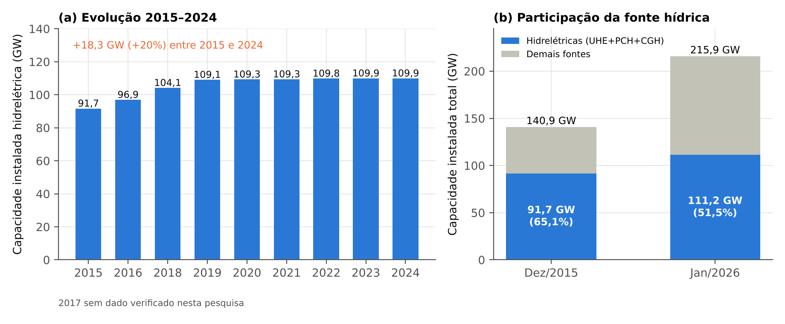
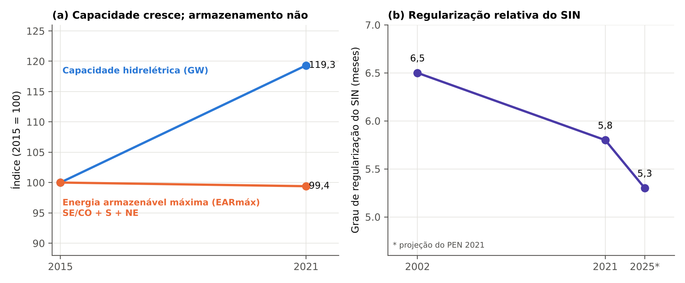

# Resumo

As restrições hidráulicas operativas — limites de vazão defluente mínima e máxima, de níveis de reservatório, de taxas de variação e de turbinamento — convertem usos múltiplos da água, segurança de barragens e condicionantes ambientais em regras que o Operador Nacional do Sistema Elétrico (ONS) precisa respeitar ao despachar as usinas hidrelétricas. Este artigo examina essas restrições em escala nacional, bacia a bacia (São Francisco, Paraná, Grande, Paranaíba, Paranapanema, Iguaçu, Uruguai, Tocantins, Paraíba do Sul e bacias amazônicas), identifica seus valores, o instrumento que as sustenta (outorga da Agência Nacional de Águas e Saneamento Básico – ANA, licença do IBAMA, cadastro do ONS, decisões do Comitê de Monitoramento do Setor Elétrico – CMSE) e suas implicações energéticas, ambientais e regulatórias. Em seguida, aprofunda o caso da UHE Belo Monte, cujo regime de vazões no Trecho de Vazão Reduzida (TVR) da Volta Grande do Xingu é definido pelos hidrogramas A e B incorporados à outorga da ANA. Descreve-se o funcionamento desses hidrogramas e, com um balanço hídrico mensal calibrado nos dados públicos (que reproduz a garantia física oficial com diferença de 1,0%), quantificam-se alavancas de flexibilização. Os resultados indicam que o armazenamento físico em Belo Monte é irrelevante para a regularização sazonal (1 m de deplecionamento equivale a cerca de 0,16 GWmês, frente a um déficit de aproximadamente 15,7 GWmês no período seco), de modo que "água armazenada para o período seco" só pode ser obtida no sistema, por meio de maior aproveitamento da vazão no período úmido e de coordenação com os reservatórios de regularização, ou em escala horária, por modulação para atendimento da ponta. Propõem-se seis medidas de flexibilização condicionadas a salvaguardas ecológicas e a governança compartilhada entre ANA, IBAMA, ONS, ANEEL e Ministério de Minas e Energia.

**Palavras-chave:** restrições operativas hidráulicas; Sistema Interligado Nacional; outorga; hidrograma; Belo Monte; regularização.

# Abstract

Hydraulic operating constraints — minimum and maximum outflows, reservoir levels, ramping rates and minimum turbine discharges — translate multiple water uses, dam safety and environmental conditions into rules that Brazil's system operator (ONS) must observe when dispatching hydropower plants. This article reviews these constraints nationwide, basin by basin, identifies their values, the legal instruments that support them (water-use permits issued by the National Water Agency – ANA, IBAMA licences, ONS registries and CMSE decisions) and their energy, environmental and regulatory implications. It then examines the Belo Monte Hydropower Plant, whose flow regime in the Xingu's Volta Grande Reduced-Flow Reach is set by hydrographs A and B embedded in ANA's permit. Using a monthly water balance calibrated on public data (reproducing the official firm energy within 1.0%), the study quantifies flexibilization levers. Physical storage at Belo Monte is negligible for seasonal regulation: a 1 m drawdown is worth about 0.16 GW-month against a dry-season shortfall of about 15.7 GW-month. "Stored water for the dry season" can therefore only be obtained at system level — by using more of the wet-season flow and coordinating with regulating reservoirs — or at hourly scale, through peak-shaping. Six flexibilization measures are proposed, subject to ecological safeguards and shared governance among ANA, IBAMA, ONS, ANEEL and the Ministry of Mines and Energy.

**Keywords:** hydraulic operating constraints; Brazilian interconnected system; water-use permit; hydrograph; Belo Monte; regulation.

# 1 Panorama: a capacidade hidrelétrica em 2015 e hoje

Para situar o problema, convém começar pela evolução recente do parque hidrelétrico brasileiro. No fim de 2015, a capacidade instalada de geração do país era de 140,9 GW, dos quais 91,7 GW (65,1%) em usinas hidráulicas (BRASIL, 2016). Um ano depois, o parque hidrelétrico somava 96.925 MW, um acréscimo de 5.278 MW em relação ao ano anterior, dos quais 91.499 MW em grandes usinas, 4.941 MW em pequenas centrais e 490 MW em centrais geradoras (BERTOL, 2017). Segundo as sínteses do Balanço Energético Nacional, a capacidade hidráulica atingiu 104.139 MW em 2018, 109.058 MW em 2019, 109.350 MW em 2021 e 109.922 MW em 2023 e 2024, o que representa estabilização a partir de 2019 (EPE, 2020; 2022; 2024; 2025). Em janeiro de 2026, o Sistema de Informações de Geração da ANEEL registrava 215.936,9 MW de potência fiscalizada, com 47,67% em usinas hidrelétricas de grande porte, 2,92% em pequenas centrais e 0,92% em centrais geradoras (PODER360, 2026) — o que, por cálculo dos autores sobre esses percentuais, corresponde a cerca de 111 GW hidráulicos, ou 51,5% do total.

A Figura 1 sintetiza esse movimento: entre 2015 e 2024 a capacidade hidrelétrica cresceu cerca de 18,3 GW (20%), mas a participação da fonte hídrica na capacidade total caiu de 65,1% para aproximadamente 51,5%, porque o parque total cresceu cerca de 53%, impulsionado por fontes eólica, solar e térmica. Uma única usina responde pela maior parte do acréscimo hidráulico: Belo Monte, com 11.233 MW, equivale a aproximadamente 61% do aumento líquido de capacidade hidráulica observado no período (cálculo dos autores a partir de Norte Energia, 2020, e EPE, 2025). A expansão hídrica de 2025 foi residual: 11 pequenas centrais (199,34 MW), uma usina (50 MW) e três centrais geradoras (6,70 MW), cerca de 3,5% dos 7.403,54 MW adicionados ao sistema no ano (PODER360, 2026).

{width=16.5cm}

*Fonte: elaboração própria a partir de Brasil (2016), Bertol (2017), EPE (2020; 2022; 2024; 2025) e Poder360 (2026). O valor de jan./2026 em (b) é calculado a partir dos percentuais do SIGA/ANEEL; os valores de 2015 e de 2018–2024 provêm de séries distintas (MME e EPE) e podem diferir levemente de extratos do Banco de Informações de Geração da ANEEL (por exemplo, 90.619 MW em nov./2015).*

O ponto decisivo para o tema deste artigo é que a capacidade cresceu, mas a capacidade de armazenamento não. A energia armazenável máxima (EARmáx) dos subsistemas Sudeste/Centro-Oeste, Sul e Nordeste somava 276.735 MWmês em 2015 (205.002, 19.873 e 51.860 MWmês, respectivamente; O SETOR ELÉTRICO, 2015) e 274.666 MWmês em 2021 (203.567, 19.897 e 51.602 MWmês); com o subsistema Norte (15.165 MWmês), o total do SIN era de 290.231 MWmês em 2021 (SÃO PAULO, 2021, com dados do ONS) e de 292.333 MWmês no Plano da Operação Energética 2022 (ONS, 2022a). Em termos relativos, o grau de regularização do SIN — a razão entre a EARmáx e a carga descontada da geração inflexível, em meses — foi de 6,5 meses em 2002, de 5,8 meses em 2021 e é projetado em 5,3 meses para 2025 (ONS, 2021a). Falcetta (2015) já havia documentado, para a série histórica desde 1950 e para o horizonte de planejamento até 2023, queda contínua e significativa da capacidade relativa de regularização do sistema hidrelétrico brasileiro, e matéria especializada registra que, entre 1998 e 2024, apenas dois reservatórios de acumulação foram adicionados ao SIN, contra 48 usinas a fio d'água (O SETOR ELÉTRICO, [2024?]).

{width=16.5cm}

*Fonte: elaboração própria a partir de EPE (2020; 2022), ONS (2021a; 2022a) e dados de EARmáx de 2015 e 2021 citados no texto. O índice em (a) usa o conjunto SE/CO + S + NE porque o valor de 2015 do subsistema Norte não foi localizado.*

O resultado é um sistema com mais potência hidráulica e proporcionalmente menos estoque d'água: o índice de capacidade hidrelétrica de 2021 é 119 (2015 = 100), enquanto o da EARmáx é 99,4. Nesse sistema, cada restrição hidráulica pesa mais, porque há menos reservatório para absorver variações de afluência, e porque as novas usinas — sobretudo as amazônicas — não podem "guardar" a água que não é turbinada. É nesse contexto que as restrições hidráulicas se tornaram uma das variáveis mais disputadas da operação do setor elétrico, e que o caso de Belo Monte, a maior usina a fio d'água do país, se torna emblemático.

# 2 Introdução, objetivos e nota metodológica

## 2.1 Problema e objetivos

A operação das usinas hidrelétricas brasileiras é regida por um duplo ordenamento. De um lado, a lógica eletroenergética do Sistema Interligado Nacional (SIN), na qual o ONS busca, com modelos de otimização hidrotérmica, minimizar o custo esperado de atendimento à carga ao longo de horizontes de meses a anos (PEREIRA; PINTO, 1991). De outro, a lógica dos usos múltiplos da água, consagrada na Política Nacional de Recursos Hídricos (BRASIL, 1997), que exige que a vazão e o nível dos reservatórios atendam também ao abastecimento, à navegação, ao controle de cheias, à pesca, ao turismo e à preservação de ecossistemas. A interface entre esses dois ordenamentos são as chamadas restrições operativas hidráulicas (ROH): limites declarados pelos agentes de geração ao ONS, com base em outorgas, licenças ambientais, contratos e diretrizes de segurança, que o operador deve observar no planejamento e na operação em tempo real (ONS, 2024).

Este artigo tem quatro objetivos: (i) mapear as restrições hidráulicas das principais bacias do SIN, com seus valores e instrumentos de origem; (ii) descrever o arcabouço institucional que as cria, altera e fiscaliza, com ênfase nas relações entre ANA, IBAMA, ONS, ANEEL, Ministério de Minas e Energia (MME) e Tribunal de Contas da União (TCU); (iii) detalhar o funcionamento dos hidrogramas da ANA para a UHE Belo Monte; e (iv) avaliar como esses hidrogramas poderiam ser flexibilizados para ampliar a água disponível ao sistema no período seco, discutindo os limites físicos e os custos ecológicos de cada alternativa.

## 2.2 Procedimentos e limitações

O estudo é uma análise documental e quantitativa de natureza exploratória. As fontes primárias consideradas são resoluções e outorgas da ANA, licenças e pareceres técnicos do IBAMA, cadastros e referências técnicas do ONS, relatórios da EPE, decisões do TCU e do Judiciário, além de literatura científica. A coleta dos documentos foi feita por consulta a trechos e resumos indexados, uma vez que o acesso direto a alguns repositórios oficiais não esteve disponível durante a elaboração; por isso, (a) sempre que possível os valores foram conferidos em pelo menos duas fontes independentes, (b) valores sustentados por fonte única, antigos ou com divergência entre fontes são sinalizados no texto e (c) recomenda-se que qualquer uso técnico ou jurídico dos valores aqui reproduzidos seja precedido de conferência com o texto consolidado vigente do ato normativo correspondente. As restrições mudam com frequência — em 2026 houve, por exemplo, nova revisão do cadastro do ONS para a bacia do Uruguai e nova autorização da ANA para Belo Monte — e a data de cada valor é indicada sempre que conhecida.

A análise quantitativa do caso de Belo Monte (Seção 8.5) utiliza um balanço hídrico mensal simplificado, descrito e parametrizado na própria seção, com código aberto no repositório que acompanha este artigo. Os resultados devem ser lidos como ordens de grandeza e comparações relativas entre cenários; não substituem os modelos de planejamento (NEWAVE, DECOMP e DESSEM), a modelagem hidrodinâmica empregada pelo IBAMA nem os estudos ecológicos de campo.
