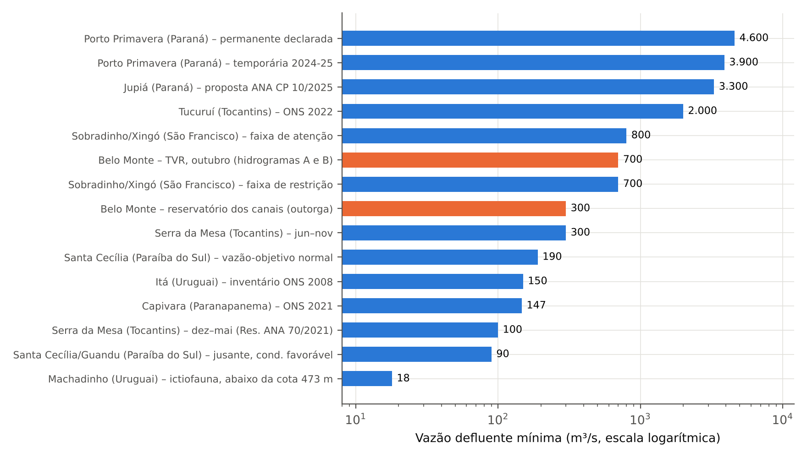

# 6 Restrições hidráulicas por bacia do SIN

Esta seção percorre as principais bacias hidrográficas com aproveitamentos hidrelétricos despachados pelo ONS, apresentando, para cada uma, as restrições encontradas, seus valores, o instrumento que as sustenta e as implicações. Os valores foram coletados conforme a nota metodológica da Seção 2.2; sempre que a fonte é antiga ou única, isso é indicado. O Quadro 2 sintetiza o conjunto e a Figura 3 compara as vazões mínimas referenciadas.

## 6.1 Bacia do São Francisco (Sobradinho, Itaparica, Xingó e Três Marias)

O São Francisco é a bacia na qual a ANA primeiro consolidou, em 2017, um sistema de faixas de operação. A Resolução ANA nº 2.081/2017 divide o ano em período úmido (dezembro a abril) e seco (maio a novembro) e define, para Sobradinho, três faixas conforme o volume útil: Normal (acima de 60% até 100%), Atenção (acima de 20% até 60%) e Restrição (até 20%) (ANA, 2017). Na faixa Normal, a vazão mínima média diária de Sobradinho é de 800 m³/s (e de 1.100 m³/s para Xingó, conforme leitura da resolução em fonte secundária); na faixa de Atenção, a defluência mínima de Sobradinho e Xingó é de 800 m³/s, com teto de vazão média mensal de 1.000 m³/s em Xingó; e na faixa de Restrição a defluência mínima média diária de ambos cai para 700 m³/s, com vazão média máxima mensal de 900 m³/s em Xingó, cabendo ao ONS, a partir de recomendação da ANA, estabelecer as vazões de Sobradinho, Itaparica e Xingó nesse estado (ANA, 2017). Itaparica não opera por faixas próprias: deve manter armazenamento mínimo de 30% do volume útil quando Sobradinho está nas faixas Normal ou Atenção. Sempre que for necessário reduzir a defluência abaixo de 800 m³/s, a Chesf deve informar o IBAMA (ANA, 2017).

O regime anterior fixava patamar de normalidade de 1.300 m³/s; desde a Resolução ANA nº 442/2013 a agência vinha autorizando reduções sucessivas abaixo desse valor durante a estiagem prolongada da década passada (ANA, 2017). Em 2021, a Resolução ANA nº 81/2021 alterou temporariamente as regras, permitindo que a faixa de operação Normal passasse para Atenção quando Sobradinho atingisse volume útil inferior a 60%, e determinando suspender a operação excepcional de setembro e outubro caso o volume caísse abaixo de 40% (ANA, 2021a). Na crise de 2021, o ONS indicou ainda a importância de flexibilizar a vazão mínima de Xingó em abril e maio (ONS, 2021b). As implicações são típicas: o piso de Sobradinho e Xingó protege a navegação, o abastecimento, a irrigação e a salinidade do Baixo São Francisco, mas, em seca prolongada, entra em conflito com a preservação do próprio reservatório, e a norma explicita esse conflito ao transferir a decisão ao ONS, sob recomendação da ANA, quando o volume é crítico.

## 6.2 Bacia do Paraná (Jupiá, Porto Primavera, Ilha Solteira e Três Irmãos)

O rio Paraná concentra as restrições de maior magnitude em termos de vazão. A Análise de Impacto Regulatório da ANA registra, como restrições permanentes declaradas ao ONS, defluências mínimas de 3.300 m³/s em Jupiá e de 4.600 m³/s em Porto Primavera, e uma restrição temporária de 3.900 m³/s em Porto Primavera de novembro de 2024 a outubro de 2025; a Consulta Pública nº 10/2025 propõe 3.300 m³/s para Jupiá e 3.900 m³/s para Porto Primavera (ANA, 2025). Em 2021, a Portaria MME nº 524 autorizou testes de redução para 2.300 m³/s em Jupiá e 2.700 m³/s em Porto Primavera, mas a vazão de Porto Primavera foi mantida em 2.900 m³/s por risco de aprisionamento de peixes em poças marginais (BRASIL, 2022); a Resolução ANA nº 142/2022 recomenda operar em torno de 3.300 e 3.900 m³/s para garantir o funcionamento da escada de peixes durante a piracema (ANA, 2022b). Quanto às vazões máximas, documento do Ministério do Desenvolvimento Regional registra limites de 16.000 m³/s em Jupiá e de 24.000 m³/s em Porto São José, associados ao controle de cheias do rio Paraná (MDR, [s.d.]).

Nos reservatórios de Ilha Solteira e Três Irmãos, o nível máximo normal é de 328,00 m e o nível mínimo de navegação da hidrovia Tietê-Paraná é de 325,40 m; a ANA autorizou, em caráter temporário, cota de 324,80 m entre 7 de dezembro de 2020 e 15 de janeiro de 2021 (Resolução ANA nº 55/2020) e de 325,0 m em julho e agosto de 2021 (Resolução ANA nº 84/2021) (ANA, 2020a; 2021b). O ONS esclareceu que a referência de 323 m usada no volume útil de Ilha Solteira considera a outorga da ANA para não interromper a hidrovia (ONS, 2021c). As implicações são particularmente evidentes: a geração hidráulica compulsória exigida pelas defluências mínimas de Jupiá e Porto Primavera foi apontada pelo ONS como o principal fator limitante para o ganho energético de outras fontes em 2021, e o MME estimou que a flexibilização dessas vazões, combinada à alocação de recursos não hidráulicos, contribuiu com cerca de 10,7 pontos percentuais da energia armazenada máxima do subsistema Sudeste/Centro-Oeste (ONS, 2021b; BRASIL, 2022). A decisão do CMSE que reduziu o piso de Porto Primavera de 4.600 para 3.900 m³/s foi qualificada por Kelman (2021) como um "seguro" energético e de potência.

## 6.3 Bacia do rio Grande (Furnas, Mascarenhas de Moraes, Marimbondo e Água Vermelha)

Para o rio Grande vigora a Resolução ANA nº 193/2024, em vigor desde dezembro de 2024, que reproduz o desenho por faixas e períodos: no período úmido, Furnas opera na faixa Normal com volume útil igual ou superior a 50% (sem limite de vazão máxima), na faixa de Atenção entre 20% e 50% (vazão média mensal máxima de 500 m³/s) e na faixa de Restrição abaixo de 20% (400 m³/s); Marimbondo e Água Vermelha devem manter nível mínimo correspondente a 15% de seus volumes úteis quando Furnas está nas faixas Normal ou Atenção; e, quando Furnas ou Mascarenhas de Moraes estão em Restrição, o ONS deve enviar à ANA estudos mensais de criticidade hidrológica, podendo os limites ser flexibilizados para equilibrar os armazenamentos dos rios Grande e Paranaíba, mediante solicitação do ONS e autorização da ANA (ANA, 2024a). Os limiares do período seco divergem entre as leituras consultadas (há referência a 70% e 30% do volume útil) e precisam ser conferidos no texto da resolução. Um exemplo de aplicação é dezembro de 2024: com Furnas a 27,65% do volume útil no dia 1º, o reservatório operou na faixa de Atenção, com vazão limitada a 500 m³/s e média mensal de 269 m³/s, recuperando-se para cerca de 39% ao fim do mês (ANA, 2024c).

Uma particularidade é a chamada "cota 762 m" do lago de Furnas, instituída pela Emenda nº 106/2020 à Constituição de Minas Gerais e contestada pela União no Supremo Tribunal Federal por invadir competência privativa sobre águas e energia; há divergência entre o MME, que sustenta que a Resolução ANA nº 193/2024 obriga a preservar a cota 762 exceto em emergência do setor elétrico, e reportagens segundo as quais a cota consta apenas da constituição estadual, uma vez que o texto da resolução trata de faixas percentuais de volume (AGÊNCIA INFRA, [s.d.]a; CÂMARA DOS DEPUTADOS, 2022). O caso ilustra um tipo específico de restrição — de natureza legal estadual, voltada ao turismo e à economia regional — que concorre com as restrições federais de operação.

## 6.4 Bacia do Paranaíba (Emborcação, Itumbiara e São Simão)

Para o Paranaíba, a ANA editou inicialmente a Resolução nº 141/2022, de caráter temporário, que vigorou de 2 de janeiro a 28 de abril de 2023: limitou a defluência média de Emborcação a 140 m³/s (teto semanal de 200 m³/s) e a de Itumbiara a 490 m³/s (teto semanal de 784 m³/s), com suspensão dos limites quando o armazenamento superasse 70% do volume útil (ANA, 2022c). O regime permanente foi definido em maio de 2024 (Resolução ANA nº 194/2024; a numeração aparece como 193 em alguns documentos de consulta). Em Emborcação a faixa Normal começa em 50% do volume útil e a de Atenção abrange de 20% a menos de 50%; em Itumbiara, no período seco, a faixa Normal tem limite igual à turbinagem máxima da outorga (2.928 m³/s) e a faixa de Atenção, média mensal máxima de 1.960 m³/s; e São Simão deve manter ao menos 15% do volume útil enquanto Itumbiara estiver em Normal ou Atenção (ANA, 2024b). A ANA justificou o regime pela necessidade de recuperação dos reservatórios da cascata e pelo desequilíbrio entre os armazenamentos de Furnas e do Paranaíba. O resultado prático dessa política foi o acompanhamento mensal pela ANA, que relatou, após um mês de vigência das resoluções de 2024, recuperação dos reservatórios nas bacias do Grande e do Paranaíba (ANA, 2024c).

## 6.5 Bacia do Paranapanema (Jurumirim, Chavantes, Capivara e Mauá)

A Resolução ANA nº 132/2022, em vigor desde 1º de janeiro de 2023, estabelece quatro faixas de operação — Normal, Atenção, Alerta e Restrição — para Jurumirim, Chavantes e Capivara, com limites de vazão defluente máxima média semanal que diminuem à medida que o volume útil cai: em Jurumirim, 182 m³/s na faixa de Atenção (volume útil abaixo de 40%), 147 m³/s em Alerta (abaixo de 30%) e 90 m³/s em Restrição (abaixo de 25%); em Chavantes, 322 m³/s em Atenção e 161 m³/s em Alerta; e, em Capivara, sem restrição de vazão máxima na faixa Normal (volume útil igual ou superior a 40%) (ANA, 2022a). Em todas as faixas devem ser atendidos os requisitos ambientais e a vazão mínima remanescente fixada pelo órgão licenciador, e as condições são suspensas em situações de controle de cheias ou de segurança de barragem (ANA, 2022a). As defluências mínimas declaradas ao ONS são independentes: para Capivara, apresentação do ONS de 2021 lista restrição permanente de 276 m³/s e, a partir de 13 de novembro de 2021, defluência mínima de 147 m³/s; para Mauá, 79 m³/s e, a partir de 2020, 150 m³/s; e em Jurumirim a mínima de 147 m³/s foi temporariamente reduzida para 100 e depois 60 m³/s em estiagens, para evitar o volume morto (ONS, 2021d; PARANAPANEMA, [s.d.]). As cifras da minuta submetida à consulta pública diferem das da resolução publicada e não devem ser usadas como fonte normativa.

## 6.6 Bacia do Iguaçu (Foz do Areia, Segredo, Salto Santiago e Baixo Iguaçu)

No Iguaçu predominam restrições de vazão máxima e de proteção de infraestrutura a jusante. Os documentos da sala de acompanhamento da ANA para as bacias do Sul registram, para Salto Santiago, duas restrições de defluência máxima declaradas ao ONS: 17.000 m³/s, para proteger a ponte da BR-158, e 19.000 m³/s, para proteger a casa de força da usina; os valores aparecem idênticos em apresentações de 2023, 2024 e 2026 (ANA, 2026b). Os boletins diários da ANA para o Iguaçu acompanham a vazão no Hotel Cataratas e apresentam, como referência, vazão mínima de 350 m³/s para a beleza cênica das Cataratas, que não é restrição operativa do ONS mas orienta a gestão do uso múltiplo (ANA, 2026c). Em setembro de 2026, a Copel manteve comportas abertas e rebaixou preventivamente Foz do Areia, que estava com 88% de armazenamento, de forma coordenada com o ONS, para criar folga para absorver afluências (CENÁRIO ENERGIA, 2026b). O cenário ilustra o outro lado do espectro das ROH: enquanto no Paranapanema e no Grande o problema é a escassez, no Iguaçu a restrição crítica é a de máximo, e o custo da flexibilidade é o risco de cheia em União da Vitória.

## 6.7 Bacia do Uruguai (Itá, Machadinho, Campos Novos, Barra Grande e Passo Fundo)

O cadastro do ONS para a bacia do Uruguai (CD-OR.UR.URU, revisão 61, vigente desde 22 de julho de 2026) traz regras específicas por usina. Em Machadinho, com o reservatório abaixo da cota 473 m, recomenda-se defluência mínima da ordem de 18 m³/s para a ictiofauna, não necessariamente contínua; em Campos Novos, a variação de defluência é limitada a 200 m³/s por hora quando a vazão está até 8.000 m³/s e a 400 m³/s por hora acima disso, e a redução de vazão abaixo de 2.500 m³/s é restrita para evitar o aprisionamento de peixes entre rochas a jusante (ONS, 2026). Um inventário de 2008 listava para Itá vazão mínima de jusante de 150 m³/s, valor que precisa ser conferido no cadastro vigente (ONS, 2008). Em estiagens severas no Sul, a baixa regularização das usinas do Uruguai, em que o volume útil é pequeno, levou à suspensão de geração em usinas e à adoção de operações especiais de fim de semana (NSC TOTAL, [s.d.]; CANALENERGIA, [s.d.]). O monitoramento de cheias é do Serviço Geológico do Brasil, por meio do Sistema de Alerta Hidrológico, e a regularização do Uruguai por Campos Novos e Barra Grande condiciona as afluências a Itá e Machadinho (DESAFIOS, [2016?]).

## 6.8 Bacia do Tocantins-Araguaia (Serra da Mesa, Lajeado, Peixe Angical, Estreito e Tucuruí)

Na cascata do Tocantins, apenas Serra da Mesa, Peixe Angical e Tucuruí têm capacidade de regularização, e Serra da Mesa, por estar na cabeceira, é o principal regularizador até Tucuruí (ANA, 2020b). A Resolução ANA nº 70/2021 fixa para Serra da Mesa defluência mínima média diária de 100 m³/s de dezembro a maio e de 300 m³/s de junho a novembro (ANA, 2021c). Para Tucuruí, a apresentação do ONS de fevereiro de 2022 lista defluência mínima de 2.000 m³/s (restrição declarada FSAR-H 261/2018), taxa máxima de variação da vazão vertida de 3.000 m³/s por dia, vazão turbinada mínima de 4.500 m³/s de novembro a fevereiro (período de piracema) e taxa máxima de variação da vazão turbinada de 600 m³/s nesse período (ONS, 2022b). Esses valores precisam ser confirmados para 2026. O Tocantins mostra uma terceira família de restrições, de caráter sazonal e biológico, em que o calendário reprodutivo dos peixes determina o regime de turbinamento.

## 6.9 Bacia do Paraíba do Sul (Santa Branca, Funil, Santa Cecília e a transposição para o Guandu)

No Paraíba do Sul a restrição central não é de uma usina, mas de um sistema: a vazão a jusante de Santa Cecília e a transposição para o rio Guandu, que abastece cerca de 9 milhões de pessoas na Região Metropolitana do Rio de Janeiro (JOHNSSON, 2015). A Resolução ANA nº 211/2003 fixou a vazão-objetivo em Santa Cecília em 190 m³/s, sendo 119 m³/s para a transposição e 71 m³/s para jusante; entre 2014 e 2016 sucessivas resoluções reduziram temporariamente esse patamar para até 110 m³/s para evitar o uso do volume morto dos reservatórios, e a regra atual, segundo apresentação do CEIVAP, é a da Resolução Conjunta ANA/DAEE/IGAM/INEA nº 1.382/2015: 190 m³/s em condições normais e, em condições hidrológicas favoráveis, 90 m³/s a jusante e até 160 m³/s para a transposição (ANA, 2003; CEIVAP, [s.d.]). A transposição é operada pela Light S.A. Trata-se do exemplo mais claro de restrição de abastecimento humano, que se sobrepõe à lógica eletroenergética.

## 6.10 Bacias amazônicas (Madeira e Xingu)

Nas usinas do Madeira (Santo Antônio, 3.568 MW, e Jirau, 3.750 MW) e do Xingu (Belo Monte) as restrições dominantes não são de armazenamento, porque as usinas são a fio d'água, mas de regime de vazão e de proteção ambiental. As usinas do Madeira operaram, em 2023, com vazão da ordem de 15% da média histórica e Belo Monte com cerca de 10%, em seca severa (PODER360, 2023b). A região Norte responde por apenas cerca de 5% da EARmáx do SIN (15.165 de 290.231 MWmês em 2021, cálculo dos autores sobre SÃO PAULO, 2021). A singularidade de Belo Monte, em que o regime de vazões do TVR é definido por hidrogramas na outorga da ANA, justifica o tratamento detalhado da Seção 8.

## 6.11 Síntese comparada

O Quadro 2 reúne os valores e a Figura 3 os compara em escala logarítmica. Três padrões emergem. Primeiro, há uma mudança de paradigma regulatório: de restrições fixas declaradas pelos agentes para faixas de operação condicionadas ao armazenamento (São Francisco, 2017; Paranapanema, 2022; Grande e Paranaíba, 2024), que tornam a restrição uma função do estado do sistema. Segundo, a ordem de grandeza das restrições varia de dezenas a milhares de m³/s, com os maiores valores nos grandes rios de planície (Paraná e Tocantins) e os menores nos rios de cabeceira (Uruguai). Terceiro, há grande heterogeneidade na robustez do instrumento: valores sustentados por resolução com análise de impacto regulatório (Paranapanema, Grande, Paranaíba) convivem com valores de cadastro declarados pelos agentes, às vezes datados de mais de uma década.

**Quadro 2 – Síntese de restrições hidráulicas por bacia (valores citados; verificar vigência e texto consolidado)**

| Bacia | Aproveitamento | Tipo | Valor citado | Instrumento / fonte | Observação |
|:--|:--|:--|:--|:--|:--|
| São Francisco | Sobradinho, Xingó | Vazão mín. por faixa | 800 (Atenção); 700 (Restrição) m³/s | Res. ANA 2.081/2017 | Faixas por volume de Sobradinho |
| São Francisco | Itaparica | Volume mín. | 30% do volume útil | Res. ANA 2.081/2017 | Quando Sobradinho em Normal/Atenção |
| Paraná | Jupiá | Vazão mín. | 3.300 m³/s | AIR ANA (2025) | Permanente declarada |
| Paraná | Porto Primavera | Vazão mín. | 4.600 (perm.); 3.900 (temp. 2024–25) m³/s | AIR ANA (2025) | Mantida em 2.900 em 2021 por ictiofauna |
| Paraná | Ilha Solteira/Três Irmãos | Nível mín. | 325,40 m (navegação) | ANA; ONS | 324,80 m (2020–21) e 325,0 m (2021) temporários |
| Paraná | Jupiá / Porto São José | Vazão máx. | 16.000 / 24.000 m³/s | MDR ([s.d.]) | Controle de cheias |
| Grande | Furnas | Vazão máx. por faixa | 500 (Atenção); 400 (Restrição) m³/s | Res. ANA 193/2024 | Período úmido |
| Grande | Marimbondo, Água Vermelha | Volume mín. | 15% do volume útil | Res. ANA 193/2024 | Com Furnas em Normal/Atenção |
| Paranaíba | Emborcação, Itumbiara | Vazão média | 140 e 490 m³/s (2023) | Res. ANA 141/2022 | Temporária; suspensa acima de 70% |
| Paranaíba | Itumbiara | Vazão máx. | 2.928 (Normal seco); 1.960 (Atenção) m³/s | Res. ANA 194/2024 | Média mensal |
| Paranapanema | Jurumirim | Vazão máx. semanal | 182 / 147 / 90 m³/s | Res. ANA 132/2022 | Atenção / Alerta / Restrição |
| Paranapanema | Capivara | Vazão mín. | 276 (perm.); 147 m³/s | ONS (2021d) | Dados de 2021 |
| Iguaçu | Salto Santiago | Vazão máx. | 17.000 (ponte); 19.000 (usina) m³/s | ANA (2026b) | Declaradas ao ONS |
| Uruguai | Machadinho | Vazão mín. | ~18 m³/s | ONS (2026) | Abaixo da cota 473 m |
| Uruguai | Campos Novos | Taxa de variação | 200 / 400 m³/s·h | ONS (2026) | Conforme faixa de vazão |
| Tocantins | Serra da Mesa | Vazão mín. | 100 (dez–mai); 300 (jun–nov) m³/s | Res. ANA 70/2021 | — |
| Tocantins | Tucuruí | Vazão mín.; turbinada mín. | 2.000; 4.500 (nov–fev) m³/s | ONS (2022b) | Dados de 2022 |
| Paraíba do Sul | Santa Cecília | Vazão-objetivo | 190 (119 + 71) m³/s | Res. 211/2003; Res. Conjunta 1.382/2015 | 90 a jusante em condição favorável |
| Xingu | Belo Monte (TVR) | Vazão mín. mensal | 700 m³/s (outubro) a 8.000 m³/s (abril, hidrograma B) | Outorga ANA 1.522/2024 | Seção 8 |
| Xingu | Belo Monte (canais) | Vazão mín. | 300 m³/s | Res. ANA 911/2014 | Reduzida até 100 m³/s em 2024 e 2026 |

*Fonte: elaboração própria a partir das fontes indicadas.*

{width=16.5cm}

*Fonte: elaboração própria a partir das fontes do Quadro 2.*

# 7 Episódios de flexibilização e seus efeitos

A observação dos episódios de flexibilização é útil porque revela quando e como o sistema abre mão de uma restrição. Três episódios merecem destaque.

**A crise hídrica de 2020–2021.** Diante das piores afluências em décadas no Sudeste, o CMSE e, depois, a CREG (criada pela MP nº 1.055/2021) recomendaram flexibilizações em Jupiá, Porto Primavera, Ilha Solteira, Três Irmãos, Sobradinho, Xingó e Furnas (BRASIL, 2021; ONS, 2021b). As medidas incluíram reduzir vazões mínimas, rebaixar cotas de navegação e reduzir volumes mínimos (por exemplo, 15% de volume útil para Furnas e Mascarenhas de Moraes até 30 de novembro de 2021). A avaliação da EPE aponta que a crise revelou restrições até então ocultas na modelagem e reduziu a garantia física do parque hidrelétrico (EPE, 2023), e Kelman (2021) extrai daí a recomendação de incorporar as restrições aos modelos. O custo ambiental foi mitigado em um caso específico: a recomendação de reduzir Porto Primavera até 2.700 m³/s foi limitada a 2.900 m³/s por risco ecológico (BRASIL, 2022).

**A seca amazônica de 2023–2024.** Em setembro de 2024, com previsão de que a água disponível em setembro ficasse em 43% da média no SIN, o ONS solicitou ao CMSE que mantivesse vazão mínima de 100 m³/s no reservatório intermediário de Belo Monte para assegurar seu acionamento nos horários de pico; Ibama e ANA autorizaram a redução emergencial por 71 dias (SANTOS, 2024; CENÁRIO ENERGIA, 2026a). Em outubro de 2024 a usina operou com duas das 18 unidades por cerca de duas horas e meia por dia no horário de maior demanda, e a menor geração diária do ano foi de 174 MW, em 27 de agosto (SANTOS, 2024).

**A reedição em 2026.** Em 11 de agosto de 2026, a ANA autorizou, por meio da Resolução nº 299, a redução do piso do reservatório intermediário de 300 para até 100 m³/s até 30 de novembro, após testes com 250, 200 e 150 m³/s, justificada por chuvas de janeiro a julho em torno de 89% da média e por probabilidade superior a 90% de persistência do El Niño; a medida não altera as vazões do TVR (ANA, 2026a; CENÁRIO ENERGIA, 2026a). O episódio é comparável aos de 2021 em um aspecto — a decisão é sempre excepcional e temporária — e diferente em outro: o ato de 2026 inclui gatilhos de paralisação definidos pelo IBAMA, ou seja, a flexibilização vem acompanhada de monitoramento e de reversibilidade explícita.
