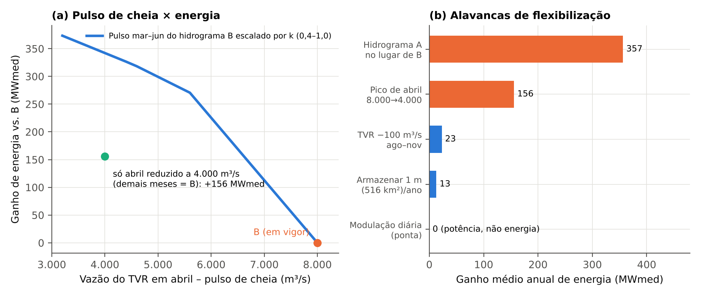

# 9 Flexibilização dos hidrogramas e obtenção de água para o período seco

## 9.1 O limite físico: quanto se pode armazenar em Belo Monte

A pergunta que motiva esta seção — como flexibilizar os hidrogramas para obter água armazenada para gerar no período seco — tem uma resposta que começa por um limite físico. Como mostrado na Seção 8.1, o projeto tem deplecionamento nulo e volume útil de regularização desprezível. É possível dimensionar o que significaria criar alguma faixa de operação. Com produtibilidade de 0,791 MW por m³/s, cada hm³ turbinado equivale a cerca de 220 MWh. Um rebaixamento de 1 m sobre os 516 km² do conjunto liberaria 516 hm³, ou 113 GWh — 0,155 GWmês, o que corresponde a 0,05% da energia armazenável máxima do SIN (292.333 MWmês) e a cerca de 13 MWmed se esse ciclo ocorresse uma vez por ano. Um rebaixamento de 2 m dobraria o valor, para 227 GWh. O déficit de energia da casa principal no período seco, calculado como a diferença entre a média anual (4.472 MW) e a geração de agosto a novembro (552 MW em média) ao longo de quatro meses, é de aproximadamente 15,7 GWmês. Ou seja, um metro de deplecionamento cobriria cerca de 1% desse déficit.

Para que o armazenamento firmasse de modo relevante a estiagem seria necessário um volume de outra ordem de grandeza. Elevar em 1.000 m³/s a vazão aduzida aos canais durante os 122 dias de agosto a novembro exigiria 10,5 km³, o que equivale a 2,2 vezes o volume total dos reservatórios de Belo Monte a 97,00 m (cerca de 4,8 km³), e isso sem considerar que esse volume nunca esteve disponível como volume útil. É por essa razão que Fearnside (2006) enfatizou que a regularização do Xingu dependeria do reservatório Babaquara/Altamira, de cerca de 6.140 km², e que a opção por um projeto a fio d'água, sem esse reservatório, tornou a geração de Belo Monte refém da sazonalidade natural. A conclusão é inequívoca: nenhuma flexibilização de hidrograma, isolada, é capaz de "criar" estoque físico em Belo Monte para o período seco. O que se pode fazer é agir em outras escalas de tempo e de espaço.

## 9.2 Quatro escalas de armazenamento

O Quadro 7 organiza as formas de "armazenar" água ou energia segundo a escala temporal e o lugar onde o estoque se forma. A mais relevante para o sistema é a escala sazonal, mas ela não é física em Belo Monte: é virtual e se forma nos reservatórios de regularização do SIN.

**Quadro 7 – Escalas de armazenamento associadas a Belo Monte**

| Escala | Onde se forma o estoque | Ordem de grandeza (cálculo próprio) | O que entrega | Instrumento necessário |
|:--|:--|:--|:--|:--|
| Horas a dias | Reservatórios do Xingu e intermediário, em faixa estreita | 25 hm³ para 4 h de ponta em setembro (0,05 m sobre 516 km²) | Potência na ponta (≈ 1,7 GW por 4 h), não energia | Janelas de conformidade; faixa operativa licenciada |
| Semanas a meses | SIN: usinas de regularização que poupam água quando Belo Monte gera mais | 0,79 GWmês por 1.000 m³/s·mês; 4,3 GWmês entre abril e julho (A em vez de B) | Energia no período seco, via despacho | Coordenação ONS; hidrograma por tipo de ano |
| Sazonal | Reservatórios de regularização a montante (inexistentes) | ≈ 10,5 km³ para +1.000 m³/s em ago–nov | Firmeza de energia | Nova obra (fora do escopo) |
| Plurianual | Reservatórios do SIN (Serra da Mesa, Tucuruí e outros) | EARmáx do SIN: 292 GWmês | Segurança de suprimento | Planejamento do SIN |

*Fonte: elaboração própria. Valores a partir do modelo descrito na Seção 8.5.*

A primeira escala, de horas a dias, é a única em que a flexibilização do hidrograma — mais precisamente, da regra de conformidade — cria estoque físico real em Belo Monte. A segunda, de semanas a meses, é a que importa para o "armazenamento para o seco": ela depende de usar mais água de Belo Monte nos meses em que o recurso é abundante, para que as usinas de regularização do sistema guardem a água que, de outro modo, teriam turbinado. Esse raciocínio está presente na própria concepção das usinas estruturantes da Amazônia: segundo a Brasil Energia, na estação chuvosa, operando em força máxima, essas usinas permitiriam que as usinas com reservatório do Sudeste-Centro-Oeste e do Nordeste economizassem água para o período seco, e Belo Monte, Jirau, Santo Antônio e Teles Pires geraram juntas 336.623 GWh em cinco anos de operação plena, equivalentes a 10,87% da carga do SIN (BRASIL ENERGIA, [s.d.]b). O texto emprega o modo condicional e não mede a economia de água; trata-se, portanto, de hipótese plausível cuja quantificação exigiria simulação com os modelos de despacho do ONS. O TCU, ao apontar entre os efeitos da manutenção do hidrograma conservador a menor energia armazenada em outros reservatórios, adota a mesma lógica, em sentido inverso (TCU, 2025).

## 9.3 Seis medidas de flexibilização

A partir dessas escalas, propõem-se seis medidas, ordenadas da menos para a mais controversa do ponto de vista ecológico. O Quadro 8 sintetiza os efeitos quantificados e a Figura 6 compara as alavancas.

### Medida 1 – Janelas de conformidade e modulação da casa de força principal

A Resolução ANA nº 299/2026 admite operação em pulsos no reservatório intermediário, desde que a média mínima seja respeitada em cada período de dois dias consecutivos (ANA, 2026a). A proposta é generalizar e formalizar esse princípio: o atendimento do piso de 300 m³/s (ou do que vier a substituí-lo) em média de dois a sete dias, e não em base horária, permitiria concentrar a geração em horas de ponta. Um cálculo ilustrativo para setembro, com vazão aduzida média de 350 m³/s no ano médio: armazenar durante 20 horas e turbinar durante 4 horas permitiria despachar 2.100 m³/s, ou cerca de 1,66 GW, por 4 horas, usando 25 hm³ — 0,05 m sobre os 516 km² do conjunto, ou 0,19 m sobre os 130 km² do reservatório intermediário. A comparação com a prática de outubro de 2024, em que a usina operou com duas das 18 unidades (aproximadamente 1,2 GW) por duas horas e meia por dia, mostra que há espaço para valorizar a potência (SANTOS, 2024). A medida não altera a energia mensal e, como atua nos canais, não interfere nas vazões do TVR. Os limites são a taxa de variação das vazões a jusante da casa de força — referências existentes em outras bacias, como as taxas de 200 a 400 m³/s por hora em Campos Novos e de 600 m³/s em Tucuruí na piracema (ONS, 2026; 2022b), indicam o tipo de salvaguarda que pode ser exigido — e a dinâmica de qualidade da água no reservatório intermediário, cuja baixa concentração de oxigênio em camadas profundas foi identificada pelo IBAMA na análise da redução de 2024 (CENÁRIO ENERGIA, 2026a).

### Medida 2 – Faixa operativa estreita e licenciada para o reservatório

Como o projeto tem deplecionamento nulo, a Medida 1 só é plenamente realizável com uma faixa de variação de nível formalmente licenciada. Os números mostram que ela pode ser mínima: 0,3 m sobre 516 km² equivalem a 155 hm³ ou 34 GWh, mais que suficiente para a modulação diária da Medida 1; o fator limitante não seria o volume, e sim a variação de vazão a jusante. A proposta é que o IBAMA licencie uma faixa de até 0,3 a 0,5 m, com monitoramento de margens, de macrófitas aquáticas, de oxigênio dissolvido e de navegabilidade — itens em que o IBAMA já identificou falhas de acompanhamento em 2024 (CENÁRIO ENERGIA, 2026a) — e reversão automática se os gatilhos forem acionados, modelo coerente com os gatilhos de paralisação do Ofício nº 260/2026 (ANA, 2026a).

### Medida 3 – Hidrograma por tipo de ano, com aproveitamento ecológico da água livre

A substituição da alternância anual entre A e B — que, na prática, deixou de existir — por hidrogramas definidos por tipo de ano hidrológico, com critério de classificação objetivo e verificável em tempo real (por exemplo, a vazão natural acumulada de janeiro a março), reproduz o modelo das faixas de operação dos rios Grande, Paranaíba, Paranapanema e São Francisco, adaptado ao fato de que, em Belo Monte, o estado do sistema não é o armazenamento, mas a vazão afluente. O ganho mais claro dessa medida é "sem arrependimento": nos meses em que a vazão natural excede a capacidade de turbinamento, a água excedente pode ser entregue ao TVR sem perda alguma de energia. No ano médio, esse excedente é de 4.900 m³/s em março e 5.600 m³/s em abril; em ano úmido (+30%), é de 10.540 m³/s em março e 11.450 m³/s em abril. Um hidrograma que garanta ao TVR, em tais meses, pelo menos a "água livre" teria benefício ecológico sem custo energético e, ao tornar o regime mais próximo do natural em anos de cheia, atenderia ao princípio do regime natural de vazões (POFF et al., 1997). Para anos secos, a classe correspondente deve preservar o pulso e os pisos ecológicos e declarar de antemão a ordem de prioridade entre o TVR, o piso dos canais e a geração, em vez de decidir em emergência.

### Medida 4 – Armazenamento virtual no SIN: valorizar a água do período úmido

Esta é a principal medida para "obter água armazenada para o período seco". O balanço mostra que cada 1.000 m³/s·mês turbinados a mais em Belo Monte equivalem a 0,79 GWmês, ou 0,27% da EARmáx do SIN, e que a diferença entre o hidrograma A e o B nos meses de abril a julho corresponde a 4,3 GWmês, ou 1,5% da EARmáx. Essa energia só se converte em água armazenada se for despachada de modo coordenado — o ONS precisa reduzir a geração das usinas de regularização enquanto Belo Monte opera em máxima potência — e se houver capacidade de transmissão para escoá-la. A capacidade de escoamento é uma restrição relevante: o bipolo de corrente contínua de ±800 kV entre Xingu e Rio de Janeiro foi projetado para transmitir até 4 GW (NS ENERGY BUSINESS, [s.d.]); a capacidade do bipolo entre Xingu e Estreito não pôde ser confirmada, mas, se também for de 4 GW, a soma (8 GW) seria inferior à potência instalada de 11,2 GW, de modo que parte da geração permaneceria no Norte e no Nordeste. Duas implicações decorrem disso. Primeira: a medida deve ser testada em modelos de despacho antes de qualquer pleito, porque o valor do ganho depende da folga de transmissão e do estado dos reservatórios. Segunda: ela cria um conflito direto com o ecossistema, pois o principal ganho está nos meses de abril e maio, quando o hidrograma B define o pulso de cheia. Por isso, a Medida 4 só é defensável se combinada com a Medida 3 (aproveitar a água livre) e com salvaguardas explícitas: em abril, entre 8.000 e 5.600 m³/s o custo energético da proteção ecológica é de cerca de 158 MWmed anuais, e abaixo de 5.600 m³/s o custo é nulo, porque as turbinas já estão saturadas.

### Medida 5 – Protocolo de seca para o reservatório dos canais

Os episódios de 2024 e 2026 mostram que o piso de 300 m³/s não é atendível junto com o hidrograma em seca: em ano com vazões 30% inferiores à média, o modelo indica vazão aduzida de 290 m³/s em agosto, de 20 m³/s em setembro e de 140 m³/s em outubro. A proposta é transformar a autorização emergencial reiterada em um protocolo formal, de duas ou três faixas ativadas por gatilhos hidrológicos objetivos (por exemplo, vazão natural acumulada e previsão de El Niño, critérios já usados pela ANA em 2026), com testes escalonados — como os de 250, 200 e 150 m³/s da Resolução nº 299/2026 —, condições de reversibilidade e monitoramento reforçado (ANA, 2026a). A medida preserva a integridade do hidrograma do TVR, que a ANA fez questão de manter em 2026, e reduz a incerteza regulatória sobre a ponta, em linha com a sugestão de Kelman (2021) de incorporar de modo estável aos modelos as restrições que não podem ser eliminadas. O ônus é de qualidade da água no reservatório intermediário, que deve ser tratado por gatilhos de paralisação, como já ocorre.

### Medida 6 – Redução de vazão do TVR: alavancas de baixo rendimento e alto risco

Por completeza, quantificam-se as alavancas que reduzem a água do TVR. Reduzir o pico de abril de 8.000 para 4.000 m³/s dá +156 MWmed (o ganho vem integralmente dos 2.400 m³/s entre 8.000 e 5.600 m³/s), e adotar o hidrograma A em vez do B dá +357 MWmed. Em contraste, retirar 100 m³/s do TVR de agosto a novembro dá apenas +23 MWmed e consumiria de 11% a 14% do piso de estiagem (de 700 a 900 m³/s), justamente quando a razão entre o TVR e a vazão natural já é alta e quando o rio é mais vulnerável. Essas alavancas contrariam o sentido das evidências de colapso do pulso (PEZZUTI et al., 2024; MPF, 2025a), da decisão judicial de dezembro de 2025 (MPF, 2025b) e da manifestação da diretoria do IBAMA sobre a necessidade de revisão (A PÚBLICA, 2025). Elas são aqui registradas para que o debate tenha números, e não como recomendação. A comparação mostra que o rendimento energético por m³/s é o mesmo em qualquer mês (0,79 MW por m³/s), mas o custo ecológico por m³/s retirado é muito mais alto na estiagem e no pico de cheia do que no excedente de turbinamento.

{width=16.5cm}

*Fonte: resultados do modelo de balanço hídrico mensal. Em (a), o pulso de março a junho do hidrograma B é multiplicado por k entre 0,4 e 1,0; o ponto verde mostra a redução isolada do pico de abril. Em (b), o ganho de "armazenar 1 m" equivale à energia de um ciclo anual de 516 hm³.*

**Quadro 8 – Síntese das medidas de flexibilização: efeito quantificado, risco ecológico e instrumento**

| Medida | Efeito quantificado | Tipo de ganho | Risco ecológico | Instrumento / órgão |
|:--|:--|:--|:--|:--|
| 1. Janelas de conformidade | ≈ 1,7 GW por 4 h em set. com 25 hm³ | Potência (ponta) | Baixo a moderado (variação de vazão a jusante, oxigênio) | Resolução ANA; parecer do IBAMA |
| 2. Faixa operativa estreita | 0,3 m ≈ 155 hm³ ≈ 34 GWh | Potência; flexibilidade | Moderado (margens, macrófitas, oxigênio) | Licença de operação (IBAMA); outorga (ANA) |
| 3. Hidrograma por tipo de ano | Água livre: 4.900 m³/s (mar.) e 5.600 m³/s (abr.) no ano médio | Ganho ecológico sem custo energético | Baixo (benéfico) | Revisão de hidrograma (IBAMA/ANA) |
| 4. Armazenamento virtual no SIN | 0,79 GWmês por 1.000 m³/s·mês; até 4,3 GWmês (A vs. B, abr.–jul.) | Energia no seco via despacho | Alto, se obtido reduzindo o TVR | ONS/CMSE; modelos de despacho |
| 5. Protocolo de seca | Piso dos canais de 300 para 100 m³/s sob gatilhos | Previsibilidade; ponta | Moderado (qualidade da água) | Resolução ANA; ofício do IBAMA |
| 6. Reduzir o TVR | +156 MWmed (pico de abril); +357 (A em vez de B); +23 (−100 m³/s ago.–nov.) | Energia | Alto | Não recomendada |

*Fonte: elaboração própria.*

## 9.4 Salvaguardas e governança

Qualquer flexibilização deve ser acompanhada de um desenho institucional que dê previsibilidade a todos os atores. Cinco elementos emergem da literatura e da prática regulatória. Primeiro, gatilhos objetivos e reversibilidade: a Resolução nº 299/2026 já prevê gatilhos de paralisação do IBAMA e testes escalonados, e a prática de reoperação adaptativa defendida por Richter e Thomas (2007) e por Poff e Olden (2017) pressupõe monitoramento e revisão periódica das regras. Segundo, indicadores hidrológicos de alteração: os indicadores de Richter et al. (1996) permitem verificar se o regime do TVR se afasta do natural em magnitude, época, duração, frequência e taxa de variação, e o arcabouço ELOHA (POFF et al., 2010) sugere que as regras sejam calibradas por relações entre alteração e resposta ecológica. Terceiro, participação das comunidades: o Monitoramento Ambiental Territorial Independente e o Hidrograma Piracema mostram que o conhecimento local pode aferir resultados e que a ausência de participação foi um dos motivos da contestação do "consenso" (MATI, 2023; MPF, 2025a). Quarto, análise de impacto regulatório: a ANA já adota AIR em seus atos de condições de operação (ANA, 2025), e a decisão sobre Belo Monte merece o mesmo tratamento, com valoração de custos e benefícios energéticos e ecológicos. Quinto, uma instância técnica conjunta entre ANA, IBAMA, ONS, ANEEL e MME, com transparência de dados — a Resolução nº 911/2014 já obriga o monitoramento diário de vazões turbinadas, vertidas e defluentes em Pimental e nos canais, com reporte à ANA — que reduza a oscilação entre as esferas técnica, administrativa e judicial identificada na Seção 4.

## 9.5 Roteiro de implementação

Um roteiro por etapas permite começar pelas medidas de menor risco. Na etapa 1 (imediata), adotar a Medida 3 e a Medida 5 e instituir a instância técnica conjunta e a rotina de indicadores. Na etapa 2 (seis a doze meses), executar um projeto-piloto das Medidas 1 e 2 em um período seco, com monitoramento reforçado, e simular a Medida 4 nos modelos de despacho do ONS com séries de vazões naturais diárias e com o estado dos reservatórios de regularização. Na etapa 3 (após a conclusão do processo de renovação da licença), consolidar as regras em resolução da ANA e em condicionantes do IBAMA, com revisão periódica; e discutir, em separado e com ampla participação, qualquer alteração dos pisos ecológicos do TVR. Em paralelo, fortalece-se a escala sazonal por meios distintos da flexibilização do hidrograma, como os leilões de armazenamento e de capacidade em curso (MAYER BROWN, 2025), que podem deslocar para outras tecnologias a função de ponta hoje reivindicada às usinas a fio d'água.

# 10 Discussão

A comparação entre bacias revela que o sistema brasileiro de restrições hidráulicas está em transição de um regime de valores fixos, declarados pelos agentes e raramente revistos, para um regime de regras dependentes do estado do sistema. As resoluções da ANA para o São Francisco (2017), o Paranapanema (2022) e os rios Grande e Paranaíba (2024) adotam faixas de operação, com limites que se endurecem à medida que o armazenamento cai, e incorporam o ONS em estudos mensais de criticidade e em pedidos de flexibilização. Essa arquitetura é, em essência, a mesma que se propõe para Belo Monte nas Medidas 3 e 5, com a diferença de que a variável de estado não pode ser o volume armazenado. O que a literatura de vazões ambientais traz de contribuição é a exigência de que as faixas sejam calibradas por indicadores ecológicos e não apenas por ganho energético (RICHTER et al., 1996; POFF et al., 2010).

A segunda lição é a da assimetria entre potência e energia. Kelman (2021) lembra que a expansão de fontes intermitentes poupa água, mas reduz a capacidade de resposta instantânea; as medidas 1 e 2 respondem a esse deslocamento do valor das restrições. A potência de ponta, e não a energia mensal, é o benefício que a flexibilização de Belo Monte pode entregar sem tocar nos pisos ecológicos do TVR. A terceira é a lição institucional: a história de Belo Monte mostra que, quando a regra não é estável, a decisão migra para o Judiciário e para o curto prazo, com custos mensuráveis (R$ 700 milhões em fevereiro de 2021; TCU, 2025). A quarta é de integridade da evidência: boa parte dos números disponíveis — valores de restrição, séries de vazão, estimativas de custo — é de fontes secundárias, datadas ou divergentes; a produção de uma base pública, versionada, de restrições e hidrogramas é, por si só, uma contribuição regulatória.

As limitações do estudo precisam ser explicitadas. O balanço é mensal e usa produtibilidade constante, sem variação de queda líquida (que diminui com a elevação do nível de jusante nas cheias), sem indisponibilidades e sem restrições de transmissão; usa médias mensais, que ocultam a variabilidade interanual; e a série de vazões combina fontes distintas. O resultado de validação (diferença de 1,0% frente à garantia física) é encorajador, mas não substitui a simulação com séries diárias e com os modelos do ONS. Além disso, as restrições por bacia foram obtidas, em parte, por trechos indexados de documentos e variam no tempo; valores dos Quadros 2 e 8 devem ser tratados como pontos de partida para conferência. Por fim, a análise ecológica não é original do estudo: baseia-se em literatura e em relatos de monitoramento.

# 11 Conclusões e recomendações

Este artigo examinou as restrições hidráulicas operativas nas principais bacias do SIN, o arcabouço institucional que as sustenta e, em profundidade, os hidrogramas de Belo Monte. As conclusões principais são as seguintes.

(1) O parque hidrelétrico cresceu cerca de 20% entre 2015 e 2024 (de 91,7 para 109,9 GW), mas a energia armazenável máxima permaneceu praticamente constante, e o grau de regularização do SIN caiu de 6,5 meses (2002) para 5,8 (2021) e 5,3 (2025, projeção). Como Belo Monte responde por cerca de 61% do aumento líquido da capacidade, o sistema ganhou potência, mas não estoque.

(2) As restrições hidráulicas têm origem multi-institucional — ANA (outorgas e condições de operação), IBAMA (licenças), ONS (cadastro e operação), ANEEL/MME/CMSE/CREG (garantia física e flexibilizações), TCU e Judiciário —, e a falta de coordenação entre essas esferas é fonte recorrente de instabilidade. As resoluções recentes da ANA para São Francisco, Paranapanema, Grande e Paranaíba mostram uma tendência de transição para faixas de operação condicionadas ao armazenamento, mais compatível com a variabilidade hidrológica do que valores fixos.

(3) Os hidrogramas A e B de Belo Monte, incorporados à outorga da ANA (Resolução nº 911/2014, Outorga nº 1.522/2024), definem vazões médias mensais para o TVR que variam de 700 m³/s (outubro) a 8.000 m³/s (abril, hidrograma B) e entregam ao TVR 27,4% (B) e 18,2% (A) da vazão natural média anual. O balanço hídrico reproduz a garantia física oficial com diferença de 1,0% e mostra que o hidrograma A geraria 357 MWmed (+7,7%) a mais que o B no ano médio, ganho concentrado em abril e maio.

(4) O armazenamento físico em Belo Monte é irrelevante para a regularização sazonal: 1 m de deplecionamento equivale a 0,155 GWmês, cerca de 1% do déficit de 15,7 GWmês do período seco. A flexibilização do hidrograma não pode, por si só, "criar" água armazenada para o seco. O que pode é (a) criar estoque diário para a ponta, com janelas de conformidade e faixa operativa estreita; e (b) valorizar a água do período úmido para que as usinas de regularização do SIN poupem água, medida que exige coordenação de despacho e folga de transmissão.

(5) Entre as seis medidas propostas, as de menor risco ecológico — hidrograma por tipo de ano com aproveitamento da água livre (Medida 3), protocolo de seca para o reservatório dos canais (Medida 5), janelas de conformidade (Medida 1) e faixa operativa estreita (Medida 2) — oferecem ganhos de potência, previsibilidade e benefício ecológico sem tocar nos pisos do TVR. As alavancas que retiram água do TVR (Medida 6) têm risco ecológico elevado, rendimento energético baixo na estiagem (+23 MWmed para 100 m³/s) e contrariam as evidências de colapso do pulso; não são recomendadas.

(6) Recomenda-se: constituir uma instância técnica conjunta ANA–IBAMA–ONS–ANEEL–MME com dados públicos; submeter qualquer alteração a análise de impacto regulatório e a indicadores ecológicos de alteração hidrológica; simular as medidas com os modelos do ONS e séries diárias de vazão; e criar uma base pública versionada de restrições hidráulicas por bacia. Como pesquisa futura, sugerem-se a extensão do balanço a passo diário, o acoplamento ao DESSEM e a avaliação conjunta energia-ecologia por indicadores de Richter et al. (1996).

# Anexos A e B (reservados)

*Espaço reservado para a incorporação dos dois textos sobre Belo Monte e da apresentação sobre restrições hidráulicas fornecidos pelo(s) autor(es). Esses arquivos não foram recebidos na sessão de elaboração deste artigo.*
